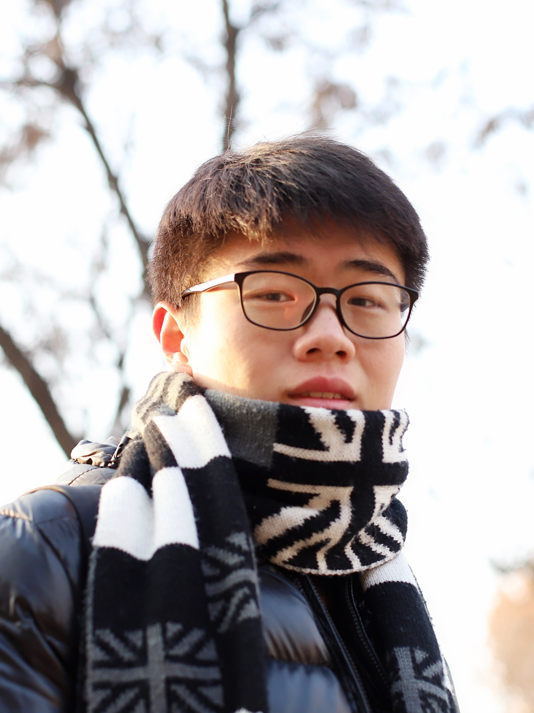

My name is **Zixiang Zhao**. I am currently a second year MPhil student at [Xi'an Jiaotong University](http://www.xjtu.edu.cn/), supervised by [Prof. Jiangshe Zhang](http://gr.xjtu.edu.cn/web/jszhang). 

I obtained my Bachelor's degree from [Northwest University](http://www.nwu.edu.cn/) in China. My current research interests are in **computer vision** and **image fusion**. 

I am expected to obtain my Master's degree in 2021 and purse **an admission of a PhD program** in the area of deep learning and computer vision.

**Email:**  
*zixiangzhao@stu.xjtu.edu.cn*  
*zxzhao.xjtu@hotmail.com*  
*zixiangzhao@foxmail.com*

---
# CURRENT RESEARCH

1. Image Processing
   - Image Fusion(infrared and visible)
   - Image Decomposition
2. Computer Vision
3. Machine Learning

---
# NEWS
- [2020-07-31] One paper on Bayesian image fusion is accepted by Signal Processing.  
- [2020-04-23] One paper on data-driven image fusion is accepted by IJCAI2020 [\[Accepted list\]](http://static.ijcai.org/2020-accepted_papers.html).

---

# PUBLICATIONS

## <u> Preprint </u>

1. ***Domain Adaptive Object Detection via Feature Separation and Alignment.***
* Chengyang Liang\*, **Zixiang Zhao**\*, Junmin Liu, Jiangshe Zhang
* Submitted to CVPR 2021 (Co-first Author) 
* Establish a Feature Separation and Alignment Network (FSANet) for domain adaptive object detection    
[*[ArXiv]*](https://arxiv.org/abs/2012.08689), [*[Code]*]()

1. ***FGF-GAN: A Lightweight Generative Adversarial Network for Pansharpening via Fast Guided Filter.***
* **Zixiang Zhao**, Jiangshe Zhang, Shuang Xu, Kai Sun, Lu Huang, Junmin Liu, Chunxia Zhang
* Submitted to ICME 2021
* Propose a generative adversarial network via the fast guided filter for pansharpening    
[*[ArXiv]*](https://arxiv.org/abs/xxxxxxxxxxxxxxxxxxx), [*[Code]*]()

1. ***When Image Decomposition Meets Deep Learning: A Novel Infrared and Visible Image Fusion Method.***
* **Zixiang Zhao**, Shuang Xu, Rui Feng, Chunxia Zhang, Junmin Liu, Jiangshe Zhang 
* Submitted to IEEE Transactions on Neural Networks and Learning Systems 
* Journal version of IJCAI2020 paper    
[*[ArXiv]*](https://arxiv.org/abs/2009.01315), [*[Code]*]()

1. ***Efficient and Interpretable Infrared and Visible Image Fusion Via Algorithm Unrolling.***
* **Zixiang Zhao**, Shuang Xu, Chunxia Zhang, Junmin Liu, Jiangshe Zhang
* Submitted to IEEE Transactions on Circuits and Systems for Video Technology
* Presented an algorithm unrolling based interpretable deep image decomposition network for infrared and visible image fusion  
[*[Arxiv]*](https://arxiv.org/abs/2005.05896), [*[Code]*]()

1. ***Deep Convolutional Sparse Coding Networks for Image Fusion.***
* Shuang Xu\*, **Zixiang Zhao**\*, Yicheng Wang, Chunxia Zhang, Junmin Liu, Jiangshe Zhang
* Submitted to IEEE Transactions on Circuits and Systems for Video Technology (Co-first Author) 
* Gave three deep convolutional sparse coding networks for three image fusion tasks as well as the solutions based on unfolding the iterative shrinkage and thresholding algorithm    
[*[Arxiv]*](https://arxiv.org/abs/2005.08448), [*[Code]*]()

1. ***MFIF-GAN: A New Generative Adversarial Network for Multi-Focus Image Fusion***
* Yicheng Wang, Shuang Xu, Junmin Liu, **Zixiang Zhao**, Chunxia Zhang, Jiangshe Zhang
* Submitted to Signal Processing: Image Communication 
* Present a novel generative adversarial network termed MFIF-GAN to translate multi-focus images into focus maps and to get the all-in-focus images further    
[*[Arxiv]*](https://arxiv.org/abs/2009.09718v2), [*[Code]*]()

## <u> Journal Papers </u>

1. ***Bayesian Fusion for Infrared and Visible Images.***
* **Zixiang Zhao**, Shuang Xu, Chunxia Zhang, Junmin Liu, Jiangshe Zhang
* **Accepted** by Signal Processing (IF2019: 4.384)     
* Established a Bayesian fusion model with a hierarchical Bayesian manner and the total-variation penalty, which can be inferred by the EM algorithm  
[*[Paper]*](https://www.sciencedirect.com/science/article/pii/S0165168420302772), [*[ArXiv]*](https://arxiv.org/abs/2005.05839), [*[Code]*](https://github.com/Zhaozixiang1228/Bayesian-Fusion)

## <u> Conference Papers </u>

1. ***DIDFuse: Deep Image Decomposition for Infrared and Visible Image Fusion.***
* **Zixiang Zhao**\*, Shuang Xu\*, Chunxia Zhang, Junmin Liu, Jiangshe Zhang
* **Accepted** by IJCAI 2020 (acceptance rate: 12.6%)
* Proposed a data-driven auto-encoder based network to accomplish the two-scale decomposition for image fusion  
[*[Paper]*](https://www.ijcai.org/Proceedings/2020/135), [*[ArXiv]*](https://arxiv.org/abs/2003.09210v1), [*[Code]*]()

---

