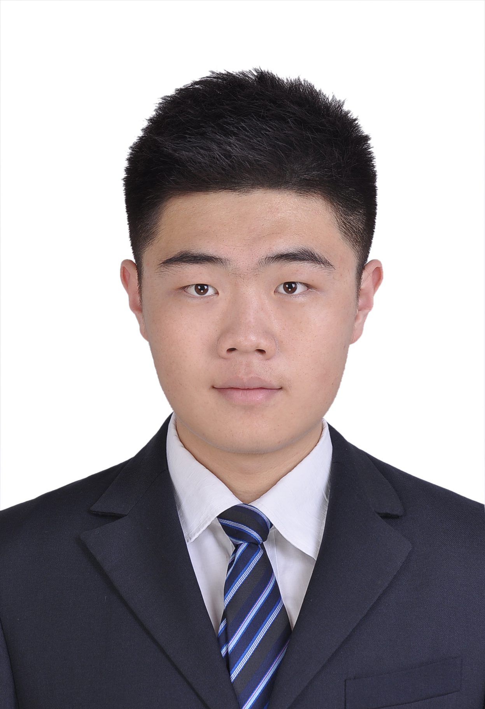

My name is **Zixiang Zhao** (赵子祥, pronounced 'Tzu-Hsiang Chao'). I am currently a PhD student in [School of Mathematics and Statistics](http://math.xjtu.edu.cn/), [Xi'an Jiaotong University](http://www.xjtu.edu.cn/), supervised by [Prof. Jiangshe Zhang](http://gr.xjtu.edu.cn/web/jszhang).

I work closely with [Prof. Chunxia Zhang](https://scholar.google.com/citations?user=b5KG5awAAAAJ&hl=zh-CN), [Prof. Junmin Liu](https://scholar.google.com/citations?user=C9lKEu8AAAAJ&hl=zh-CN) and [Doc. Shuang Xu](https://shuangxu96.github.io/) in Xi'an Jiaotong University.

I am also a visiting Ph.D. student at [Visual Computing Group](https://vcg.seas.harvard.edu/), [Harvard University](https://www.harvard.edu/), supervised by [Prof. Hanspeter Pfister](https://vcg.seas.harvard.edu/people) and work closely with [Doc. Zudi Lin](https://zudi-lin.github.io/).

My research lies at **low-level computer vision** and **model-based image processing**, and my current research is **multi-modal image processing**.

I'm open to any kinds of collaboration. Please feel free to contact me directly through email.

**Email:**  
*zixiangzhao@stu.xjtu.edu.cn*  
*zxzhao.xjtu@hotmail.com*  
*zixiangzhao@foxmail.com*  

---

# CURRENT RESEARCH

1. Image Processing (especially in Feature Separation and Information Fusion)
   - Image Fusion (infrared and visible, remote sensing, multi-focus images)
   - Multi-modal Image Processing (RGB guided depth super-resolution)
   - Image Enhancement
2. Computer Vision
   - Domain Adaption
3. Machine Learning

---

# NEWS

<!--
- [2022-03-02] One paper on guided depth map super-resolution is accepted by **CVPR 2022  (Oral Presentation) **.
-->
- [**HOT**] One paper on guided depth map super-resolution is accepted by **CVPR 2022  (Oral Presentation) **.
- [2022-06-27] One paper on seismic data processing is accepted by **IEEE TGRS**.
- [2021-04-14] One paper on model-driven image fusion is accepted by **IEEE TCSVT**.
- [2021-03-07] Two papers on remote sensing image processing are accepted by **ICME 2021** (**1 ORAL ** & 1 POSTER).
- [2021-03-01] One paper on remote sensing image processing is accepted by **CVPR 2021** (POSTER).
- [2020-07-31] One paper on Bayesian image fusion is accepted by **Signal Processing**.
- [2020-04-23] One paper on data-driven image fusion is accepted by **IJCAI 2020**.

---

# PUBLICATIONS

## <u> Selected Publications </u>

1. ***Discrete Cosine Transform Network for Guided Depth Map Super-Resolution.***
* **Zixiang Zhao**, Jiangshe Zhang, Shuang Xu, Zudi Lin, Hanspeter Pfister
* Accepted by **CVPR 2022** ** (Oral Presentation) **
* Propose an advanced Discrete Cosine Transform Network (DCTNet) for guided depth super-resolution    
  [*[Paper]*](https://openaccess.thecvf.com/content/CVPR2022/html/Zhao_Discrete_Cosine_Transform_Network_for_Guided_Depth_Map_Super-Resolution_CVPR_2022_paper.html), [*[ArXiv]*](https://arxiv.org/abs/2104.06977), [*[Code]*](https://github.com/Zhaozixiang1228/GDSR-DCTNet)

1. ***Efficient and Model-Based Infrared and Visible Image Fusion via Algorithm Unrolling.***
* **Zixiang Zhao**, Shuang Xu, Jiangshe Zhang, Junmin Liu, Chunxia Zhang, Junmin Liu
* Accepted by **IEEE Transactions on Circuits and Systems for Video Technology** (IF2019: 4.133)
* Presented an algorithm unrolling based interpretable deep image decomposition network for infrared and visible image fusion    
  [*[Paper]*](https://ieeexplore.ieee.org/document/9416456), [*[Arxiv]*](https://arxiv.org/abs/2005.05896), [*[Code]*](https://github.com/Zhaozixiang1228/IVIF-AUIF-Net)

1. ***Automatic Velocity Picking Using a Multi-Information Fusion Deep Semantic Segmentation Network.***
* Hongtao Wang, Jiangshe Zhang, **Zixiang Zhao**, Chunxia Zhang, Long li, Zhiyu Yang, Weifeng Geng
* Accepted by **IEEE Transactions on Geoscience and Remote Sensing** 
* Propose a multi-information fusion network to estimate stacking velocity from the fusion information of velocity spectra    
  [*[Paper]*](), [*[Arxiv]*](), [*[Code]*]()

1. ***Deep Gradient Projection Networks for Pan-sharpening.***
* Shuang Xu, Jiangshe Zhang, **Zixiang Zhao**, Kai Sun, Junmin Liu, Chunxia Zhang
* Accepted by **CVPR 2021** (Poster)
* Develop a model-based deep pan-sharpening approach    
  *[[Paper]](https://openaccess.thecvf.com/content/CVPR2021/html/Xu_Deep_Gradient_Projection_Networks_for_Pan-sharpening_CVPR_2021_paper.html)*, [*[ArXiv]*](https://arxiv.org/abs/2103.04584), [*[Code]*](https://github.com/xsxjtu/GPPNN)

1. ***FGF-GAN: A Lightweight Generative Adversarial Network for Pansharpening via Fast Guided Filter.***
* **Zixiang Zhao**, Jiangshe Zhang, Shuang Xu, Kai Sun, Lu Huang, Junmin Liu, Chunxia Zhang
* Accepted by **ICME 2021** ** (Oral Presentation) **
* Propose a generative adversarial network for pansharpening via the fast guided filter and the spatial attention module    
  [*[Paper]*](https://ieeexplore.ieee.org/abstract/document/9428272), [*[ArXiv]*](https://arxiv.org/abs/2101.00062), [*[Code]*](https://github.com/Zhaozixiang1228/Pansharpening-FGF-GAN)

1. ***Deep Convolutional Sparse Coding Network for Pansharpening with Guidance of Side Information.***
* Shuang Xu, Jiangshe Zhang, Kai Sun, **Zixiang Zhao**, Lu Huang, Junmin Liu, Chunxia Zhang
* Accepted by **ICME 2021** (Poster)
* Propose a side information partially guided convolutional sparse coding (SCSC) model for pansharpening    
  [*[Paper]*](https://ieeexplore.ieee.org/abstract/document/9428131), [*[ArXiv]*](https://arxiv.org/abs/2103.05946), [*[Code]*](https://github.com/shuangxu96/CSC-MMFN)

1. ***DIDFuse: Deep Image Decomposition for Infrared and Visible Image Fusion.***
* **Zixiang Zhao**\*, Shuang Xu\*, Chunxia Zhang, Junmin Liu, Jiangshe Zhang
* Accepted by **IJCAI 2020** 
* Proposed a data-driven auto-encoder based network to accomplish the two-scale decomposition for image fusion    
  [*[Paper]*](https://www.ijcai.org/Proceedings/2020/135), [*[ArXiv]*](https://arxiv.org/abs/2003.09210v1), [*[Code]*](https://github.com/Zhaozixiang1228/IVIF-DIDFuse), [*[Accepted list]*](http://static.ijcai.org/2020-accepted_papers.html)

1. ***Bayesian Fusion for Infrared and Visible Images.***
* **Zixiang Zhao**, Shuang Xu, Chunxia Zhang, Junmin Liu, Jiangshe Zhang
* Accepted by **Signal Processing** (IF2019: 4.384)
* Established a Bayesian fusion model with a hierarchical Bayesian manner and the total-variation penalty, which can be inferred by the EM algorithm    
  [*[Paper]*](https://www.sciencedirect.com/science/article/pii/S0165168420302772), [*[ArXiv]*](https://arxiv.org/abs/2005.05839), [*[Code]*](https://github.com/Zhaozixiang1228/IVIF-Bayesian-Fusion)

1. ***MFIF-GAN: A New Generative Adversarial Network for Multi-Focus Image Fusion***
* Yicheng Wang, Shuang Xu, Junmin Liu, **Zixiang Zhao**, Chunxia Zhang, Jiangshe Zhang
* Accepted by **Signal Processing: Image Communication**
* Present a novel generative adversarial network termed MFIF-GAN to translate multi-focus images into focus maps and to get the all-in-focus images further    
[*[Paper]*](https://www.sciencedirect.com/science/article/abs/pii/S0923596521001260), [*[Arxiv]*](https://arxiv.org/abs/2009.09718v2), [*[Code]*](https://github.com/ycwang-libra/MFIF-GAN)

1. ***Optimization Algorithm Unfolding Deep Networks of Detail Injection Model for Pansharpening***
* Yunqiao Feng, Junmin Liu, Kun Chen, Bo Wang, **Zixiang Zhao**
* Accepted by **IEEE Geoscience and Remote Sensing Letters**
* Present an algorithm unfolding model for Pansharpening    
  [*[Paper]*](https://ieeexplore.ieee.org/document/9430890), [*[Arxiv]*](https://arxiv.org/abs/xxxxxxx), [*[Code]*]()

## <u> Preprint </u>

1. ***Domain Adaptive Object Detection via Feature Separation and Alignment.***
* Chengyang Liang\*, **Zixiang Zhao**\*, Junmin Liu, Jiangshe Zhang
* Establish a Feature Separation and Alignment Network (FSANet) for domain adaptive object detection    
[*[ArXiv]*](https://arxiv.org/abs/2012.08689), [*[Code]*]()

1. ***When Image Decomposition Meets Deep Learning: A Novel Infrared and Visible Image Fusion Method.***
* **Zixiang Zhao**, Jiangshe Zhang, Shuang Xu, Kai Sun, Chunxia Zhang, Junmin Liu
* Journal version of IJCAI2020 paper    
  [*[ArXiv]*](https://arxiv.org/abs/2009.01315), [*[Code]*]()

1. ***Deep Convolutional Sparse Coding Networks for Image Fusion.***
* Shuang Xu\*, **Zixiang Zhao**\*, Yicheng Wang, Chunxia Zhang, Junmin Liu, Jiangshe Zhang
* Gave three deep convolutional sparse coding networks for three image fusion tasks as well as the solutions based on unfolding the iterative shrinkage and thresholding algorithm    
  [*[Arxiv]*](https://arxiv.org/abs/2005.08448), [*[Code]*]()

---

# Professional Services

## <u> PC Member | Reviewer </u>

### Conferences 

* International Joint Conference on Artificial Intelligence (IJCAI)
* AAAI Conference on Artificial Intelligence (AAAI)

### Journals 

* IEEE Transactions on Neural Networks and Learning Systems (TNNLS)
* IEEE Transactions on Circuits and Systems for Video Technology (TCSVT)
* IEEE Transactions on Knowledge and Data Engineering (TKDE)
* Information Fusion
* Signal Processing
* IEEE Signal Processing Letters (SPL)

## <u> Membership </u>
* IEEE Student Member
* AI TIME PhD Branch Leader

---

# Selected Talks

* 2021 IJCAI-SAIA Young Elite Symposium: Deep Image Decomposition for Infrared and Visible Image Fusion [[video (Chinese)]](http://www.ijcai-saia-yes.org.cn/#/conferee).    
at: [07/2021] World Artificial Intelligence Conference & Shanghai Jiao Tong University, Shanghai, China

* AI TIME PhD Debate: Opportunities and Challenges in multimodal learning [[video (Chinese)]](https://www.bilibili.com/video/BV14p4y1s77p).    
at: [07/2021] AI TIME & AMiner, Beijing, China

* AI TIME PhD Presentation (IJCAI Branch): Deep Image Decomposition for Infrared and Visible Image Fusion [[video (Chinese)]](https://www.bilibili.com/video/BV15h411h7M6).    
at: [01/2021] AI TIME & AMiner, Beijing, China

---

# More about me!

- a die-hard fan of Kobe Bryant and Los Angeles Lakers
- have a passion for basketball and participate in CUBA (Chinese University Basketball Association)
- love swimming, skiing, singing...
- a little guitar and violin
