

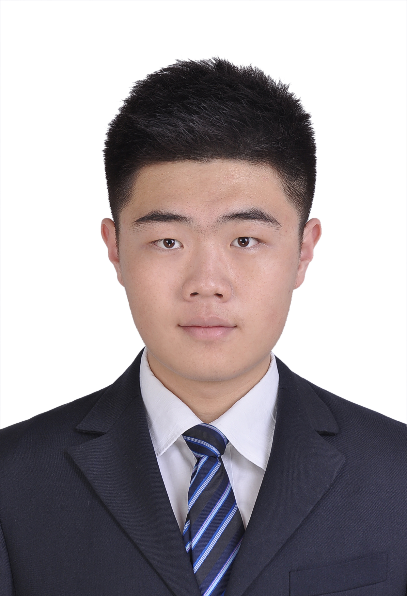

My name is **Zixiang Zhao** (赵子祥, pronounced 'Tzu-Hsiang Chao'). I am currently a Postdoctoral Researcher at [Photogrammetry and Remote Sensing Group](https://prs.igp.ethz.ch/), [ETH Zürich](https://ethz.ch/en.html), Switzerland, supervised by [Prof. Konrad Schindler](https://scholar.google.com/citations?user=FZuNgqIAAAAJ&hl=en) (IEEE Fellow).

I received my Ph.D. degree in Statistics from [School of Mathematics and Statistics](http://math.xjtu.edu.cn/), [Xi'an Jiaotong University](http://www.xjtu.edu.cn/), supervised by [Prof. Jiangshe Zhang](http://gr.xjtu.edu.cn/web/jszhang) and worked closely with [Prof. Deyu Meng](https://gr.xjtu.edu.cn/en/web/dymeng) and [Prof. Shuang Xu](https://shuangxu96.github.io/).

Previously, I was a visiting Ph.D. student at [Computer Vision Lab](https://vision.ee.ethz.ch/), [ETH Zürich](https://ethz.ch/en.html), Switzerland, supervised by [Prof. Luc Van Gool](https://ee.ethz.ch/the-department/faculty/professors/person-detail.OTAyMzM=.TGlzdC80MTEsMTA1ODA0MjU5.html) and worked closely with [Prof. Radu Timofte](https://www.informatik.uni-wuerzburg.de/computervision/home/), [Dr. Yulun Zhang](http://yulunzhang.com/) and [Dr. Kai Zhang](https://cszn.github.io/).

Additionally, I worked as a research assistant at [Visual Computing Group](https://vcg.seas.harvard.edu/), [Harvard University](https://www.harvard.edu/), USA, supervised by [Prof. Hanspeter Pfister](https://vcg.seas.harvard.edu/people) (IEEE & ACM Fellow) and collaborated closely with [Dr. Zudi Lin](https://zudi-lin.github.io/). I also contributed to [Multimedia Analytics Laboratory](https://kedema.org/Members.html), [City University of Hong Kong](https://www.cityu.edu.hk/), Hong Kong, supervised by [Prof. Kede Ma](https://kedema.org/).

I have broad research interests in Computer Vision, Generative AI, Multi-Modal Learning, and Robotics.

For ETH students, welcome to check our group’s [Projects Page](https://prs.igp.ethz.ch/education/open-topics-for-students.html) or [SiROP](https://sirop.org/) postings, or contact me directly via email with your topic of interest.  
For collaborations beyond ETH domain, I’m open to all kinds of collaboration — please feel free to reach out via email.

<strong>Email:</strong> 

  <em>zixiang.zhao[AT]hotmail[DOT]com</em>
  <button type="button" class="email-copy" aria-label="Copy email" title="Click to copy">📋</button>
 

  <em>zixiang.zhao[AT]ethz[DOT]ch</em>
  <button type="button" class="email-copy" aria-label="Copy email" title="Click to copy">📋</button>

<!-- <em><del>zixiangzhao[AT]stu[DOT]xjtu[DOT]edu[DOT]cn</del></em> -->

---

# CURRENT RESEARCH

1. Visual Perception and Reconstruction
   - Multi-modal & Multi-sensor Fusion (IR-Visible, Multi-exposure, Multi-focus, Medical, Remote Sensing)
   - Image & Video Restoration (Super-resolution, Denoising, Enhancement)
   - Image & Video Perception and Semantic Understanding
2. Generative AI and World Modeling
   - Generative Models for Image & Video Synthesis
   - Dynamic Scene Representation and Neural Rendering
   - World Models with Physical Interaction and Reasoning
3. Applied AI and Intelligent Systems
   - Autonomous Agents and Robotics
   - AI for Science: Remote Sensing and Geophysics

---

# NEWS
<!-- - HOT One first-authored paper on video fusion is accepted by **NeurIPS 2025** <strong class="emph">(Spotlight)</strong>. -->
- [2026-04] One paper on GUI Agent is accepted by **ICML 2026**. Serving as an **Area Chair** for BMVC 2026.
- [2026-02] One paper on continual learning is accepted by **CVPR 2026**.
- [2026-01] Two papers are accepted by **ICLR 2026** (Video motion transfer & Sharpness-aware minimization).
- [2025-12] Serving as an **Area Chair** for ECCV 2026.
- [2025-09] One first-authored paper on video fusion is accepted by **NeurIPS 2025** <strong class="emph">(Spotlight)</strong>.
- [2025-09] Named one of the **ICCV 2025 Outstanding Reviewers**.
- [2025-09] Named to [Stanford University's list of the World's Top 2% Scientists (2025)](https://elsevier.digitalcommonsdata.com/datasets/btchxktzyw/8).
- [2025-08] Serving as an **Area Chair** for CVPR 2026; One paper on parameterized low-rank regularizer is accepted by **IJCV**.
- [2025-06] Two papers are accepted by **ICCV 2025** (Retinex-based image fusion & Hyper-spectral image restoration); One paper on 3D indoor scene layout generation is accepted by **IROS 2025** <strong class="emph">(Oral)</strong>.
- [2025-05] One paper on quantization of video generation model is accepted by **ICML 2025**.
- [2025-03] One paper on unpaired point cloud completion is accepted by **IEEE TMM**.
- [2025-02] One paper on multi-modality image fusion is accepted by **CVPR 2025** <strong class="emph">(Highlight)</strong>.
- [2025-01] One paper on weight binarization for diffusion model is accepted by **ICLR 2025**.
- [2024-11] One paper on multi-modality image fusion is accepted by **IEEE TCSVT**.
- [2024-09] One paper on image fusion is accepted by **IJCV**; One paper on continual learning is accepted by **NeurIPS 2024**; One paper on hyper-spectral image denoising is accepted by **IEEE TGRS**.
- [2024-06] One paper on seismic data processing is accepted by **IEEE TGRS**.
- [2024-05] Two papers are accepted by **ICML 2024** (First-authored: Vision-language image fusion & Residual binarization for image super-resolution).
- [2024-04] Gave a presentation @ Peking University.
- [2024-02] One first-authored paper on multi-modality image fusion is accepted by **CVPR 2024**.
- [2023-10] One paper on 3D Object Recognition is accepted by **IEEE TNNLS**.
- [2023-09] Gave a presentation @ Cambridge University.
- [2023-07] Two first-authored papers on image fusion and depth map super-resolution are accepted by **ICCV 2023** (1 <strong class="emph">Oral</strong> & 1 Poster).
- [2023-05] Named one of the **CVPR 2023 Outstanding Reviewers**.
- [2023-03] One first-authored paper on multi-modality image fusion is accepted by **CVPR 2023**.
- [2022-06] Two papers on seismic data processing are accepted by **IEEE TGRS**.
- [2022-03] One first-authored paper on guided depth map super-resolution is accepted by **CVPR 2022** <strong class="emph">(Oral)</strong>.
- [2021-04] One first-authored paper on model-driven image fusion is accepted by **IEEE TCSVT**.
- [2021-03] Two papers (one first-authored) on remote sensing image processing are accepted by **ICME 2021** (1 <strong class="emph">Oral</strong> & 1 Poster).
- [2021-03] One paper on remote sensing image processing is accepted by **CVPR 2021**.
- [2020-07] One first-authored paper on Bayesian image fusion is accepted by **Signal Processing**.
- [2020-04] One first-authored paper on data-driven image fusion is accepted by **IJCAI 2020**.

---

# SELECTED PUBLICATIONS

You can find the full list on my [**Google Scholar**](https://scholar.google.com/citations?user=tUv_X8cAAAAJ&hl).

<strong>&dagger;</strong> denotes the corresponding author(s).

## <u> First-Author / Project Leader </u>
1. 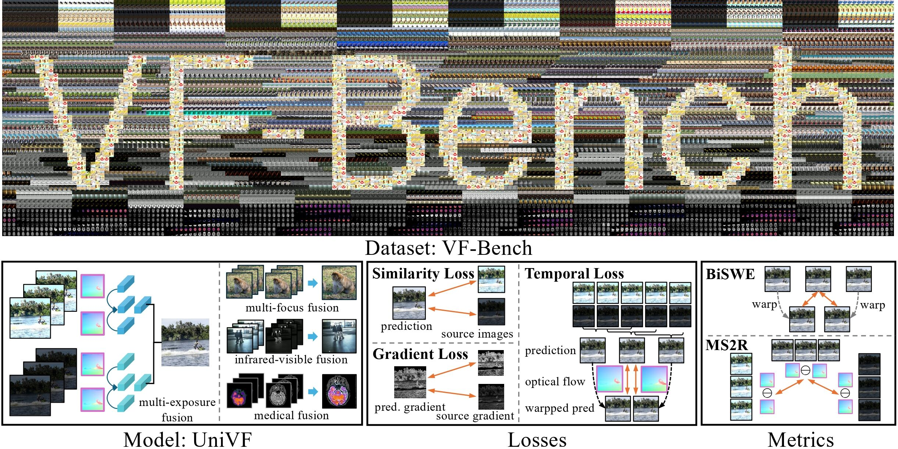 ***A Unified Solution to Video Fusion: From Multi-Frame Learning to Benchmarking***
* **Zixiang Zhao**, Haowen Bai, Bingxin Ke, Yukun Cui, Lilun Deng, Yulun Zhang, Kai Zhang, Konrad Schindler
* **Neural Information Processing Systems (NeurIPS) 2025** <strong class="emph">(Spotlight)</strong>
* Pioneering the first unified framework, benchmark, loss and evaluation protocol for video fusion across four key tasks    
  [Project Page🔥](https://vfbench.github.io/), [arXiv](https://arxiv.org/abs/2505.19858), [Code](https://github.com/Zhaozixiang1228/VF-Bench)

1. 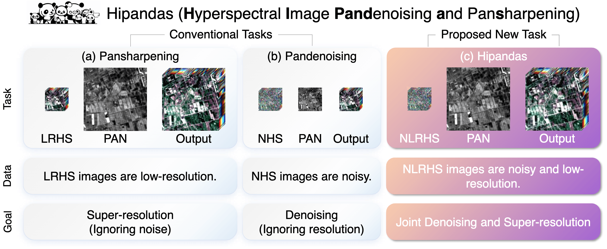 ***Hipandas: Hyperspectral Image Joint Denoising and Super-Resolution by Image Fusion with the Panchromatic Image***
* Shuang Xu, **Zixiang Zhao&dagger;**, Haowen Bai, Chang Yu, Jiangjun Peng, Xiangyong Cao&dagger;, Deyu Meng
* **IEEE/CVF International Conference on Computer Vision (ICCV) 2025** 
* Propose a novel learning paradigm that reconstructs HRHS images from noisy low-resolution HSIs (LRHS) and high-resolution PAN images  
  [Paper](https://openaccess.thecvf.com/content/ICCV2025/html/Xu_Hipandas_Hyperspectral_Image_Joint_Denoising_and_Super-Resolution_by_Image_Fusion_ICCV_2025_paper.html), [arXiv](https://arxiv.org/abs/2412.04201), [Code](https://github.com/shuangxu96/Hipandas)

1. 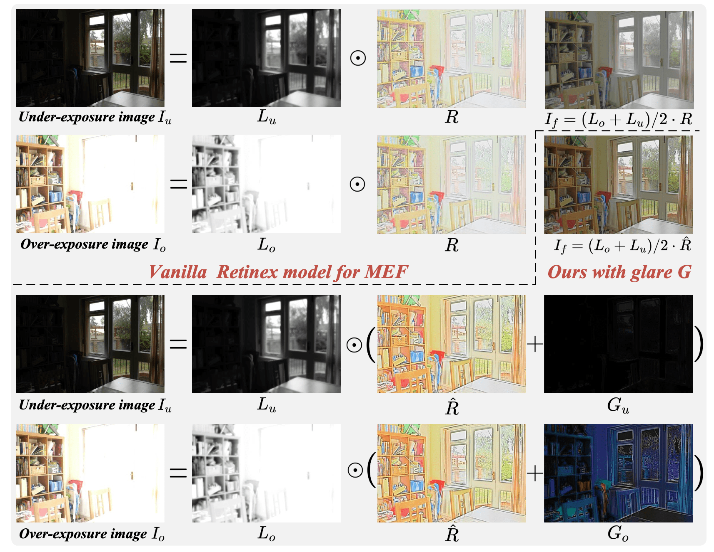 ***Retinex-MEF: Retinex-based Glare Effects Aware Unsupervised Multi-Exposure Image Fusion***
* Haowen Bai, Jiangshe Zhang&dagger;, **Zixiang Zhao&dagger;**, Lilun Deng, Yukun Cui, Shuang Xu
* **IEEE/CVF International Conference on Computer Vision (ICCV) 2025** 
* Introduce an unsupervised and controllable method termed Retinex-MEF  
  [Paper](https://openaccess.thecvf.com/content/ICCV2025/html/Bai_Retinex-MEF_Retinex-based_Glare_Effects_Aware_Unsupervised_Multi-Exposure_Image_Fusion_ICCV_2025_paper.html), [arXiv](https://arxiv.org/abs/2503.07235), [Code](https://github.com/HaowenBai/Retinex-MEF)
  
1. 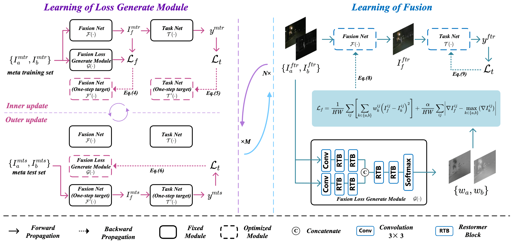 ***Task-driven Image Fusion with Learnable Fusion Loss***
* Haowen Bai, Jiangshe Zhang&dagger;, **Zixiang Zhao&dagger;**, Yichen Wu, Lilun Deng, Yukun Cui, Tao Feng, Shuang Xu
* **IEEE/CVF Conference on Computer Vision and Pattern Recognition (CVPR) 2025** <strong class="emph">(Highlight)</strong>
* Propose a fusion framework incorporating a learnable fusion loss guided by downstream task loss    
  [Paper](https://openaccess.thecvf.com/content/CVPR2025/html/Bai_Task-driven_Image_Fusion_with_Learnable_Fusion_Loss_CVPR_2025_paper.html), [arXiv](https://arxiv.org/abs/2412.03240), [Code](https://github.com/HaowenBai/TDFusion)

1. 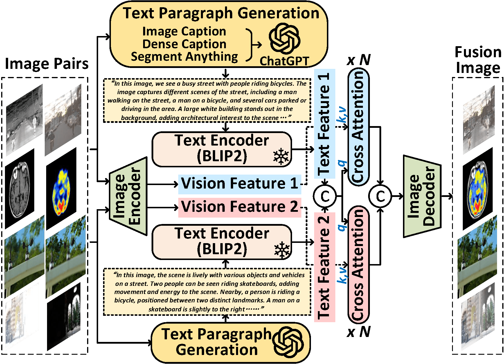 ***Image Fusion via Vision-Language Model***
* **Zixiang Zhao**, Lilun Deng, Haowen Bai, Yukun Cui, Zhipeng Zhang, Yulun Zhang, Haotong Qin, Dongdong Chen, Jiangshe Zhang, Peng Wang, Luc Van Gool
* **International Conference on Machine Learning (ICML) 2024** 
* Introduce a novel fusion paradigm, for the first time, utilizing explicit textual information to guide image fusion    
  [Project Page](https://zhaozixiang1228.github.io/Project/IF-FILM/), [Paper](https://openreview.net/pdf?id=eqY64Z1rsT), [arXiv](https://arxiv.org/abs/2402.02235), [Code](https://github.com/Zhaozixiang1228/IF-FILM)

1. 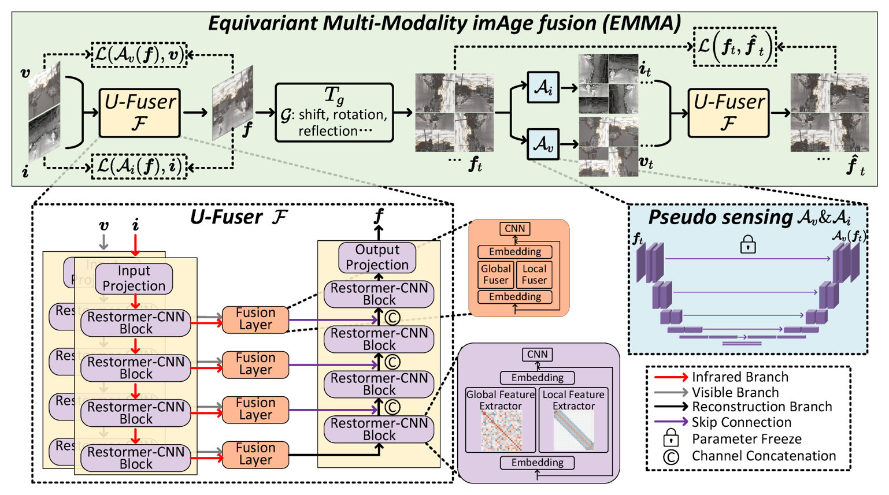 ***Equivariant Multi-Modality Image Fusion***
* **Zixiang Zhao**, Haowen Bai, Jiangshe Zhang, Yulun Zhang, Kai Zhang, Shuang Xu, Dongdong Chen, Radu Timofte, Luc Van Gool
* **IEEE/CVF Conference on Computer Vision and Pattern Recognition (CVPR) 2024** 
* Propose a novel end-to-end self-supervised fusion algorithm based on the equivariant sensing and imaging prior     
  [Paper](https://openaccess.thecvf.com/content/CVPR2024/html/Zhao_Equivariant_Multi-Modality_Image_Fusion_CVPR_2024_paper.html), [arXiv](https://arxiv.org/abs/2305.11443), [Code](https://github.com/Zhaozixiang1228/MMIF-EMMA)

1. 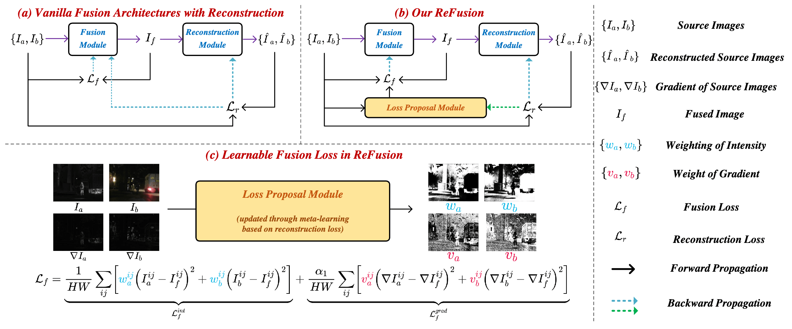 ***ReFusion: Learning Image Fusion from Reconstruction with Learnable Loss via Meta-Learning***
* Haowen Bai, **Zixiang Zhao&dagger;**, Jiangshe Zhang&dagger;, Yichen Wu, Lilun Deng, Yukun Cui, Shuang Xu, Baisong Jiang
* **International Journal of Computer Vision (IJCV) 2024**
* Propose a unified meta-learning based image fusion framework that dynamically optimizes the fusion loss through source image reconstruction    
  [Paper](https://link.springer.com/article/10.1007/s11263-024-02256-8), [arXiv](https://arxiv.org/abs/2312.07943), [Code](https://github.com/HaowenBai/ReFusion)

1. 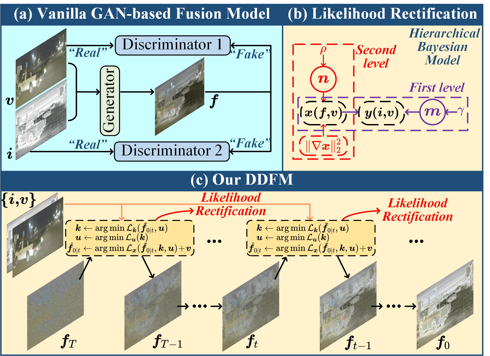 ***DDFM: Denoising Diffusion Model for Multi-Modality Image Fusion***
* **Zixiang Zhao**, Haowen Bai, Yuanzhi Zhu, Jiangshe Zhang, Shuang Xu, Yulun Zhang, Kai Zhang, Deyu Meng, Radu Timofte, Luc Van Gool
* **IEEE/CVF International Conference on Computer Vision (ICCV) 2023** <strong class="emph">(Oral)</strong>
* Propose a novel fusion algorithm based on the denoising diffusion sampling model     
  [Paper](https://openaccess.thecvf.com/content/ICCV2023/html/Zhao_DDFM_Denoising_Diffusion_Model_for_Multi-Modality_Image_Fusion_ICCV_2023_paper.html), [arXiv](https://arxiv.org/abs/2303.06840), [Code](https://github.com/Zhaozixiang1228/MMIF-DDFM)

1. 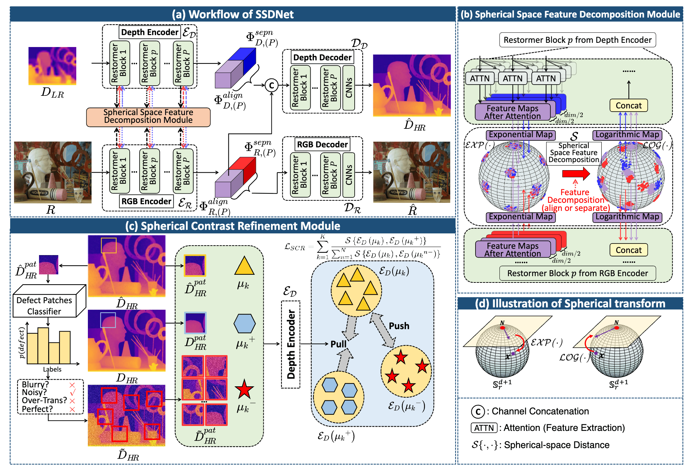 ***Spherical Space Feature Decomposition for Guided Depth Map Super-Resolution***
* **Zixiang Zhao**, Jiangshe Zhang, Xiang Gu, Chengli Tan, Shuang Xu, Yulun Zhang, Radu Timofte, Luc Van Gool
* **IEEE/CVF International Conference on Computer Vision (ICCV) 2023** 
* Propose a Spherical Space feature Decomposition network (SSDNet) and spherical contrast refinement for guided depth super-resolution       
  [Paper](https://openaccess.thecvf.com/content/ICCV2023/html/Zhao_Spherical_Space_Feature_Decomposition_for_Guided_Depth_Map_Super-Resolution_ICCV_2023_paper.html), [arXiv](https://arxiv.org/abs/2303.08942), [Code](https://github.com/Zhaozixiang1228/GDSR-SSDNet)

1. 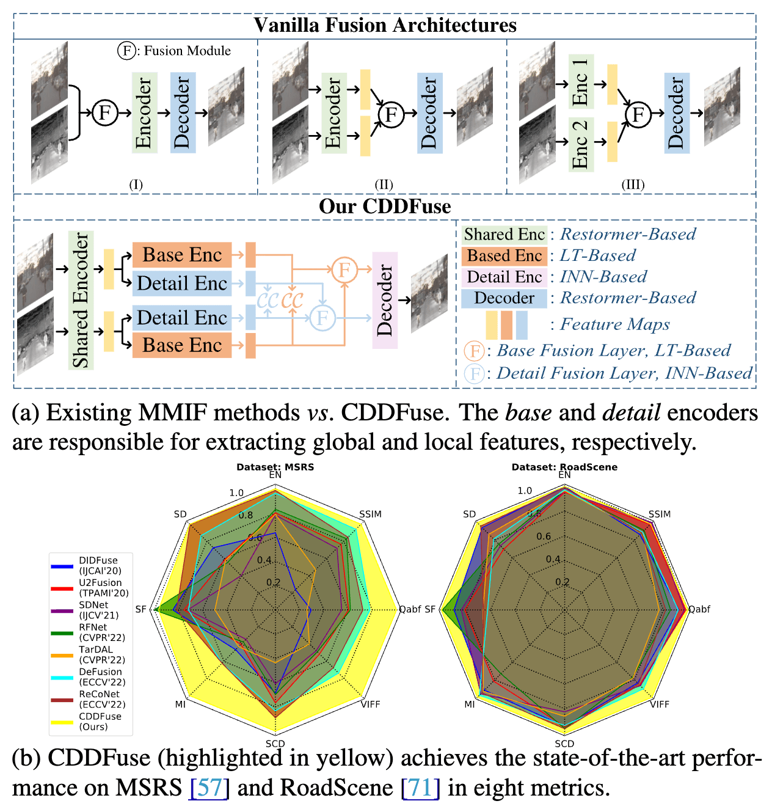 ***CDDFuse: Correlation-Driven Dual-Branch Feature Decomposition for Multi-Modality Image Fusion***
* **Zixiang Zhao**, Haowen Bai, Jiangshe Zhang, Yulun Zhang, Shuang Xu, Zudi Lin, Radu Timofte, Luc Van Gool
* **IEEE/CVF Conference on Computer Vision and Pattern Recognition (CVPR) 2023** 
* Propose a Correlation-Driven feature Decomposition Fusion (CDDFuse) network for multi-modality image fusion    
  [Paper](https://openaccess.thecvf.com/content/CVPR2023/html/Zhao_CDDFuse_Correlation-Driven_Dual-Branch_Feature_Decomposition_for_Multi-Modality_Image_Fusion_CVPR_2023_paper.html), [arXiv](https://arxiv.org/abs/2211.14461), [Code](https://github.com/Zhaozixiang1228/MMIF-CDDFuse)

1. 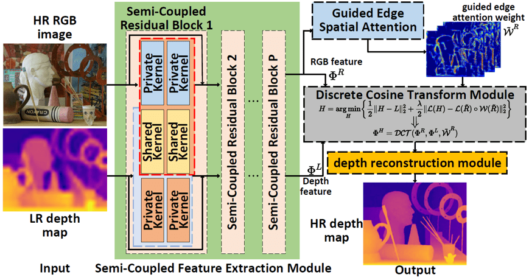 ***Discrete Cosine Transform Network for Guided Depth Map Super-Resolution***
* **Zixiang Zhao**, Jiangshe Zhang, Shuang Xu, Zudi Lin, Hanspeter Pfister
* **IEEE/CVF Conference on Computer Vision and Pattern Recognition (CVPR) 2022** <strong class="emph">(Oral)</strong>
* Propose an advanced Discrete Cosine Transform Network (DCTNet) for guided depth super-resolution    
  [Paper](https://openaccess.thecvf.com/content/CVPR2022/html/Zhao_Discrete_Cosine_Transform_Network_for_Guided_Depth_Map_Super-Resolution_CVPR_2022_paper.html), [arXiv](https://arxiv.org/abs/2104.06977), [Code](https://github.com/Zhaozixiang1228/GDSR-DCTNet)

1. 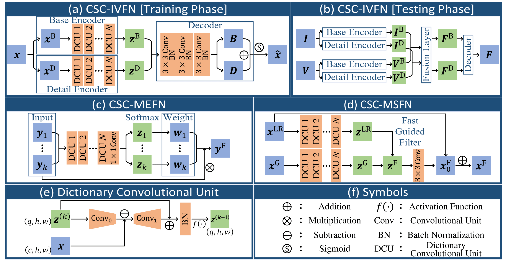 ***Deep Convolutional Sparse Coding Networks for Interpretable Image Fusion***
* **Zixiang Zhao**, Jiangshe Zhang, Haowen Bai, Yicheng Wang, Yukun Cui, Lilun Deng, Kai Sun, Chunxia Zhang, Junmin Liu, Shuang Xu
* **IEEE/CVF Conference on Computer Vision and Pattern Recognition Workshop (CVPRW) 2023**
* Propose three deep convolutional sparse coding networks for interpretable image fusion via unfolding the iterative shrinkage and thresholding algorithm        
  [Paper](https://openaccess.thecvf.com/content/CVPR2023W/AML/html/Zhao_Deep_Convolutional_Sparse_Coding_Networks_for_Interpretable_Image_Fusion_CVPRW_2023_paper.html), [Code](https://github.com/Zhaozixiang1228/IF-CSCFuse)

1.  ***Efficient and Model-Based Infrared and Visible Image Fusion via Algorithm Unrolling***
* **Zixiang Zhao**, Shuang Xu, Jiangshe Zhang, Chengyang Liang, Chunxia Zhang, Junmin Liu
* **IEEE Transactions on Circuits and Systems for Video Technology (IEEE TCSVT) 2021** 
* <strong class="emph">(Top 1% Highly Cited Paper)</strong>
* Presented an algorithm unrolling based interpretable deep image decomposition network for infrared and visible image fusion    
  [Paper](https://ieeexplore.ieee.org/document/9416456), [arXiv](https://arxiv.org/abs/2005.05896), [Code](https://github.com/Zhaozixiang1228/IVIF-AUIF-Net)

1. 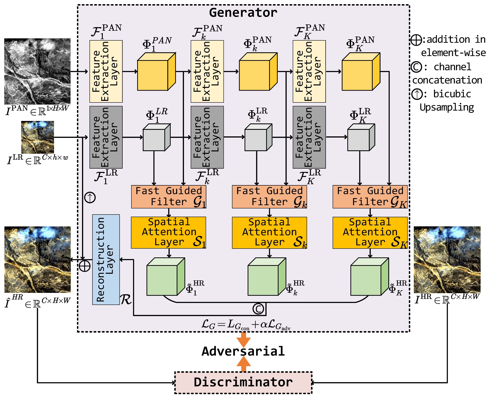 ***FGF-GAN: A Lightweight Generative Adversarial Network for Pansharpening via Fast Guided Filter***
* **Zixiang Zhao**, Jiangshe Zhang, Shuang Xu, Kai Sun, Lu Huang, Junmin Liu, Chunxia Zhang
* **IEEE International Conference on Multimedia and Expo (ICME) 2021** <strong class="emph">(Oral)</strong>
* Propose a generative adversarial network for pansharpening via the fast guided filter and the spatial attention module    
  [Paper](https://ieeexplore.ieee.org/abstract/document/9428272), [arXiv](https://arxiv.org/abs/2101.00062), [Code](https://github.com/Zhaozixiang1228/Pansharpening-FGF-GAN)

1. 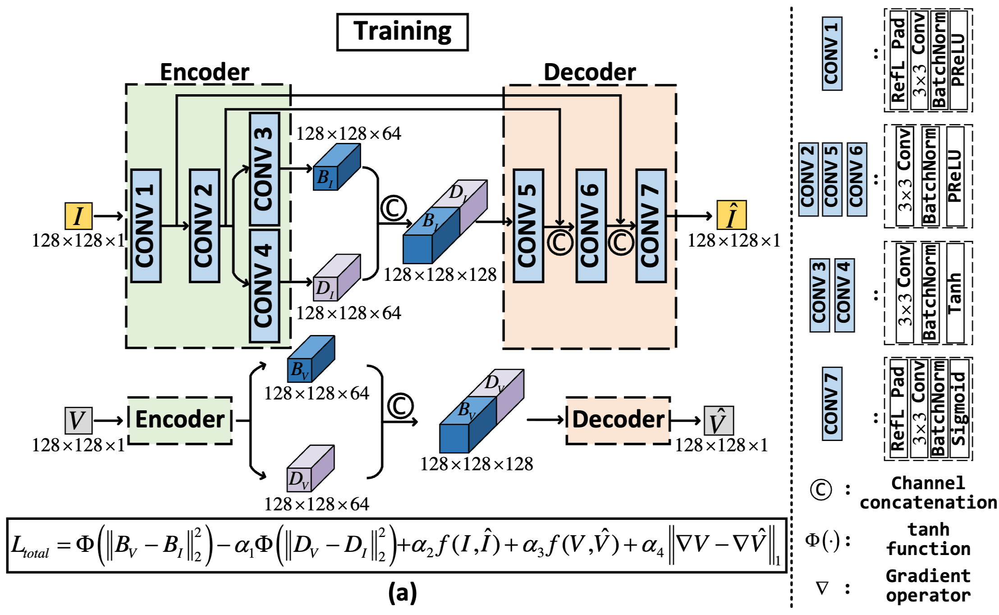 ***DIDFuse: Deep Image Decomposition for Infrared and Visible Image Fusion***
* **Zixiang Zhao**\*, Shuang Xu\*, Chunxia Zhang, Junmin Liu, Jiangshe Zhang
* **International Joint Conference on Artificial Intelligence (IJCAI) 2020** 
* Proposed a data-driven auto-encoder based network to accomplish the two-scale decomposition for image fusion    
  [Paper](https://www.ijcai.org/Proceedings/2020/135), [arXiv](https://arxiv.org/abs/2003.09210v1), [Code](https://github.com/Zhaozixiang1228/IVIF-DIDFuse), [Accepted list](http://static.ijcai.org/2020-accepted_papers.html)

1. 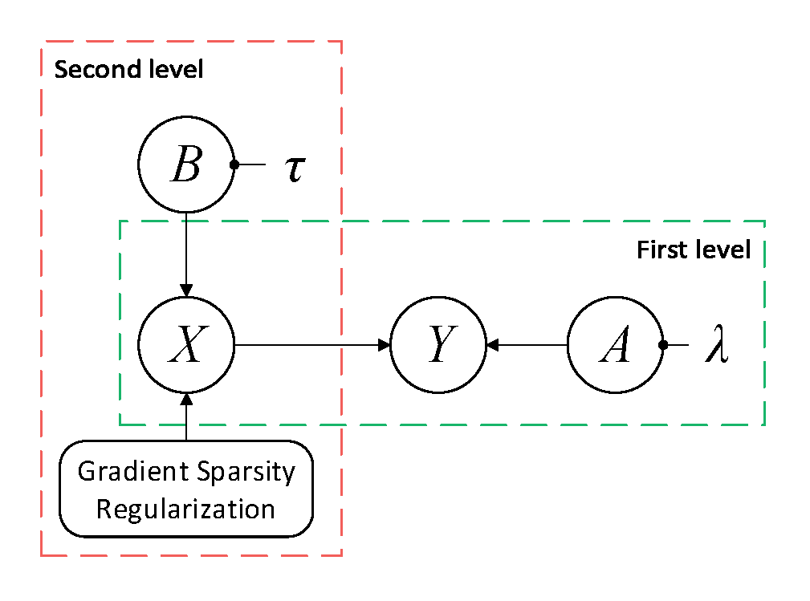 ***Bayesian Fusion for Infrared and Visible Images***
* **Zixiang Zhao**, Shuang Xu, Chunxia Zhang, Junmin Liu, Jiangshe Zhang
* **Signal Processing 2020**
* Established a Bayesian fusion model with a hierarchical Bayesian manner and the total-variation penalty, which can be inferred by the EM algorithm    
  [Paper](https://www.sciencedirect.com/science/article/pii/S0165168420302772), [arXiv](https://arxiv.org/abs/2005.05839), [Code](https://github.com/Zhaozixiang1228/IVIF-Bayesian-Fusion)

## <u> Collaborative Works </u>
1. 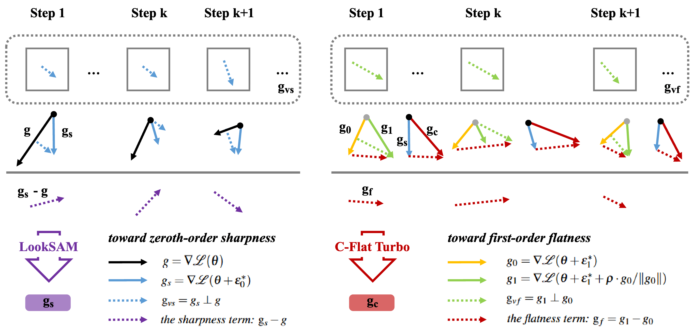 ***A Faster Path to Continual Learning***
* Wei Li, Hangjie Yuan, **Zixiang Zhao**, Borui Kang, Ziwei Liu, Tao Feng
* **IEEE/CVF Conference on Computer Vision and Pattern Recognition (CVPR) 2026**
* Propose C-Flat Turbo, a faster yet stronger optimizer that significantly reduces the training cost   
  [Paper](), [arXiv](https://arxiv.org/abs/2604.11064), [Code]()
  
1. 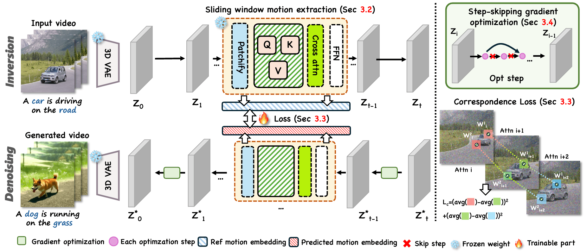 ***FastVMT: Eliminating Redundancy in Video Motion Transfer***
* Yue Ma, Zhikai Wang, Tianhao Ren, Mingzhe Zheng, Hongyu Liu, Jiayi Guo, Kunyu Feng, Yuxuan Xue, **Zixiang Zhao**, Konrad Schindler, Qifeng Chen, Linfeng Zhang
* **International Conference on Learning Representations (ICLR) 2026**
* Propose FastVMT, an efficient framework using DiT-based video generative model to transfer motion efficiently  
  [Project Page](https://fastvmt.github.io/), [Paper](https://openreview.net/forum?id=ILdBjlgibb), [arXiv](https://arxiv.org/abs/2602.05551), [Code](https://github.com/mayuelala/FastVMT)

1. 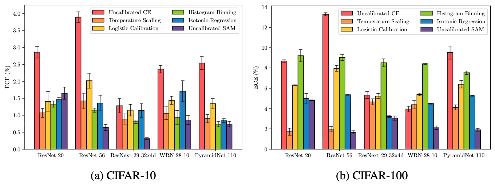 ***Towards Understanding The Calibration Benefits of Sharpness-Aware Minimization***
* Chengli Tan, Yubo Zhou, Haishan Ye, Guang Dai, Junmin Liu, Zengjie Song, Jiangshe Zhang, **Zixiang Zhao**, Yunda Hao, Yong Xu
* **International Conference on Learning Representations (ICLR) 2026**
* Beyond the well-known benefits on improving generalization, SAM is also found to be surprisingly effective in model calibration  
  [Paper](https://openreview.net/forum?id=c0ERcCz6lD), [arXiv](https://arxiv.org/abs/2505.23866), [Code]()

1. 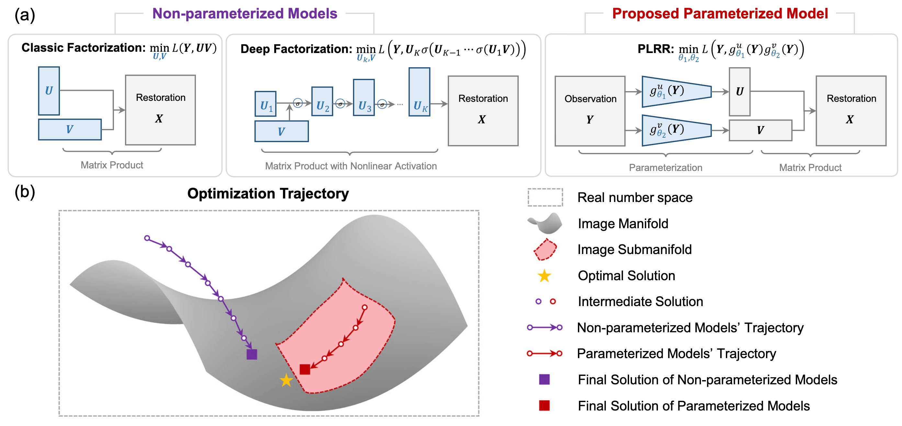 ***Parameterized Low-Rank Regularizer for High-dimensional Visual Data***
* Shuang Xu, **Zixiang Zhao**, Xiangyong Cao, Jiangjun Peng, Xi-Le Zhao, Deyu Meng, Yulun Zhang, Radu Timofte, Luc Van Gool
* **International Journal of Computer Vision (IJCV) 2025** 
* Propose a parameterized low-rank regularizer, modeling low-rank visual data through neural networks parameterized matrix factorization  
  [Paper](https://link.springer.com/article/10.1007/s11263-025-02569-2), [arXiv](), [Code](https://github.com/shuangxu96/Parameterized-Low-Rank-Regularizer)

1. 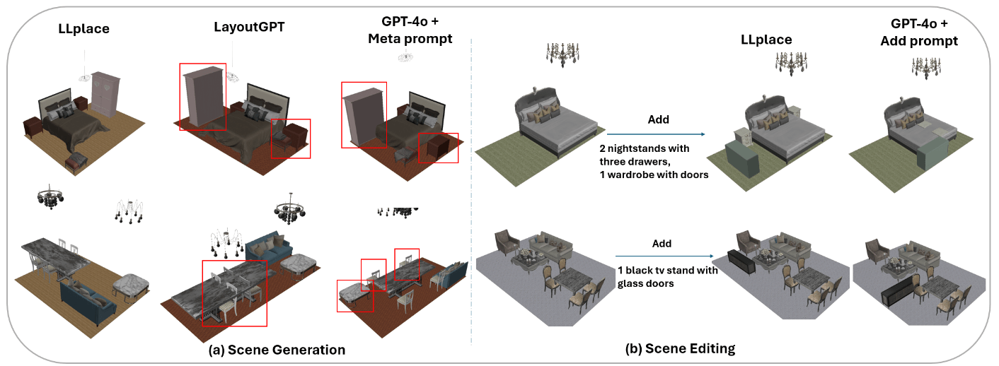 ***LLplace: Embodied 3D Indoor Layout Synthesis Framework with Large Language Model***
* Yixuan Yang, Junru Lu, **Zixiang Zhao**, Zhen Luo, James J.Q. Yu, Victor Sanchez, Feng Zheng
* **IEEE/RSJ International Conference on Intelligent Robots and Systems (IROS) 2025**
* Presented a novel 3D indoor scene layout designer based on lightweight fine-tuned open-source LLM     
  [Paper](https://ieeexplore.ieee.org/document/11246995), [arXiv](https://arxiv.org/abs/2406.03866), [Code]()

1. 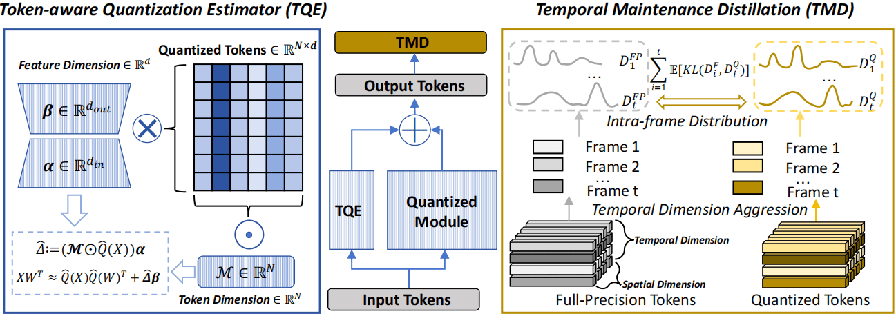 ***Q-VDiT: Towards Accurate Quantization and Distillation of Video-Generation Diffusion Transformers***
* Weilun Feng, Chuanguang Yang, Haotong Qin, Xiangqi Li, Yu Wang, Zhulin An, Libo Huang, Boyu Diao, **Zixiang Zhao**, Yongjun Xu, Michele Magno 
* **International Conference on Machine Learning (ICML) 2025**
* Presented Q-VDiT, a quantization framework specifically designed for video DiT models     
  [Paper](https://proceedings.mlr.press/v267/feng25q.html), [arXiv](https://arxiv.org/abs/2505.22167), [Code](https://github.com/cantbebetter2/Q-VDiT)

1. 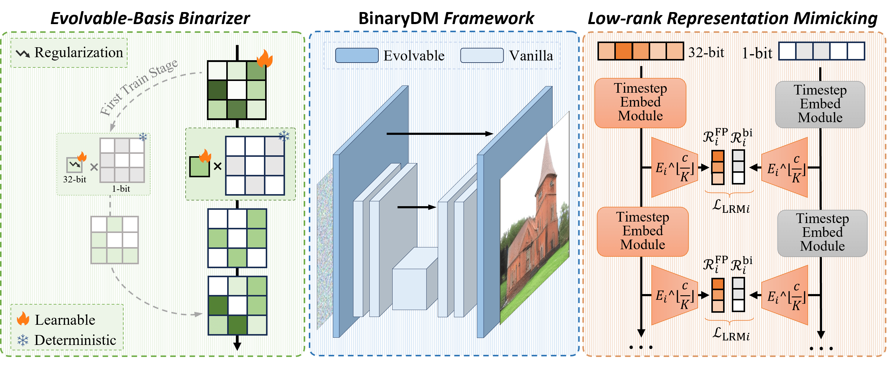 ***BinaryDM: Accurate Weight Binarization for Efficient Diffusion Models***
* Xingyu Zheng, Xianglong Liu, Haotong Qin, Xudong Ma, Mingyuan Zhang, Haojie Hao, Jiakai Wang, **Zixiang Zhao**, Jinyang Guo, Michele Magno
* **International Conference on Learning Representations (ICLR) 2025**
* Propose a weight binarization approach for diffusion models.    
  [Paper](https://openreview.net/forum?id=YaeZwhXJ4k&nesting=2&sort=date-desc), [arXiv](https://arxiv.org/abs/2404.05662), [Code](https://github.com/Xingyu-Zheng/BinaryDM)

1. 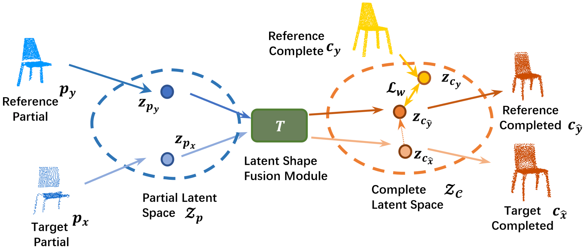 ***RefComp: A Reference-guided Unified Framework for Unpaired Point Cloud Completion***
* Yixuan Yang, Jinyu Yang, **Zixiang Zhao**, Victor Sanchez, Feng Zheng
* **IEEE Transactions on Multimedia (IEEE TMM) 2025**
* Propose a unified framework for unpaired point cloud completion    
  [Paper](https://ieeexplore.ieee.org/document/11195746), [arXiv](https://arxiv.org/abs/2504.13788), [Code]()

1. 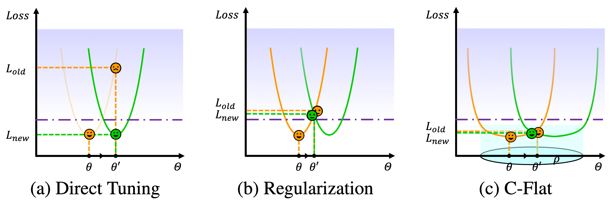 ***Make Continual Learning Stronger via C-Flat***
* Ang Bian, Wei Li, Hangjie Yuan, Yu Chengrong, Mang Wang, **Zixiang Zhao**, Aojun Lu, Pengliang Ji, Tao Feng
* **Neural Information Processing Systems (NeurIPS) 2024**
* Propose a Continual Flatness method featuring a flatter loss landscape tailored for continual learning.    
  [Paper](https://neurips.cc/virtual/2024/poster/96074), [arXiv](https://arxiv.org/abs/2404.00986), [Code](https://github.com/WanNaa/C-Flat)

1. 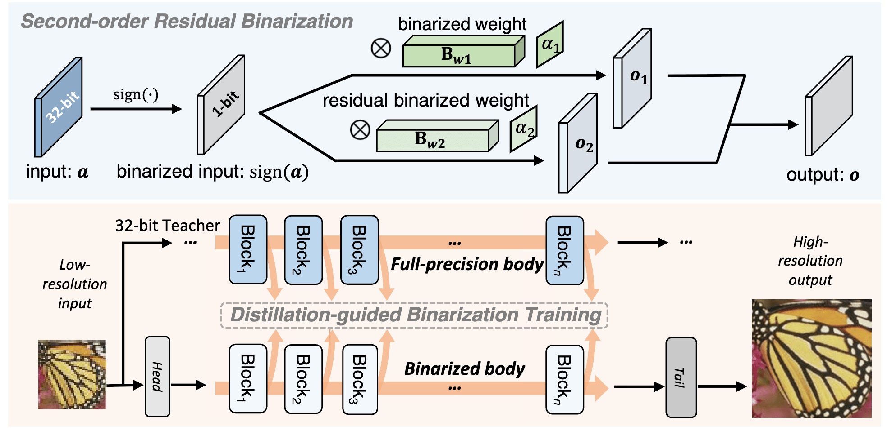 ***Flexible Residual Binarization for Image Super-Resolution***
* Yulun Zhang, Haotong Qin, **Zixiang Zhao**, Xianglong Liu, Martin Danelljan, Fisher Yu
* **International Conference on Machine Learning (ICML) 2024**
* Proposed a flexible residual binarization image super-resolution method with second-order residual binarization and distillation-guided training.    
  [Paper](https://proceedings.mlr.press/v235/zhang24bb.html), [arXiv](https://openreview.net/pdf?id=zji9DLksTz), [Code]()

1. 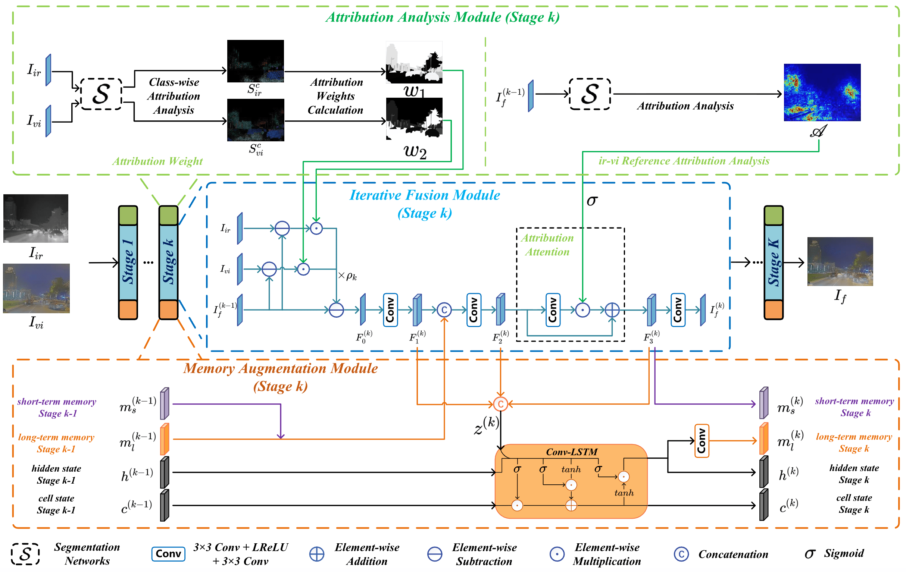 ***Deep Unfolding Multi-modal Image Fusion Network via Attribution Analysis***
* Haowen Bai, **Zixiang Zhao**, Jiangshe Zhang, Baisong Jiang, Lilun Deng, Yukun Cui, Shuang Xu, Chunxia Zhang
* **IEEE Transactions on Circuits and Systems for Video Technology (IEEE TCSVT) 2024**
* Employed attribution analysis to tailor fused images more effectively for semantic segmentation and enhance the fusion-segmentation interaction    
  [Paper](https://ieeexplore.ieee.org/abstract/document/10769519), [arXiv](https://arxiv.org/abs/2502.01467), [Code](https://github.com/HaowenBai/UAAFusion)

1. 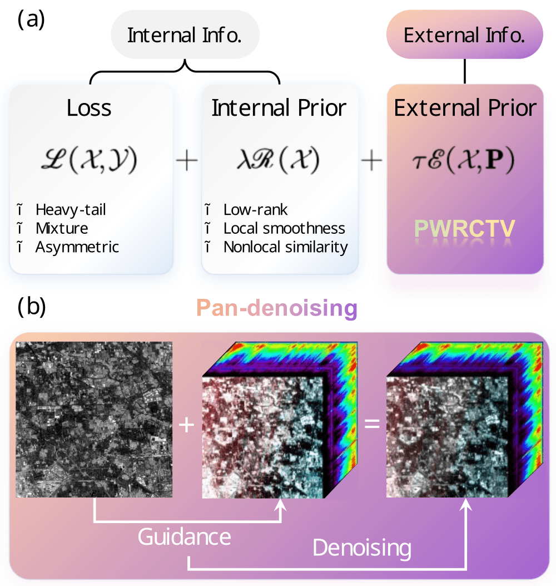 ***Pan-Denoising: Guided Hyperspectral Image Denoising via Weighted Represent Coefficient Total Variation***
* Shuang Xu, Qiao Ke, Jiangjun Peng, Xiangyong Cao, **Zixiang Zhao**
* **IEEE Transactions on Geoscience and Remote Sensing (IEEE TGRS) 2024**
* Guided hyperspectral image denoising using panchromatic image guidance    
  [Paper](https://ieeexplore.ieee.org/document/10663706), [arXiv](https://arxiv.org/abs/2407.06064), [Code](https://github.com/shuangxu96/PWRCTV)

1. 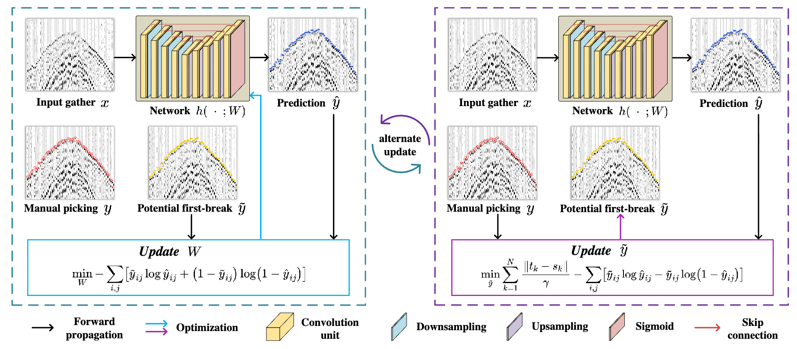 ***Simultaneous Automatic Picking and Manual Picking Refinement for First-Break***
* Haowen Bai, **Zixiang Zhao**, Jiangshe Zhang, Yukun Cui, Chunxia Zhang, Zhenbo Guo, Yongjun Wang
* **IEEE Transactions on Geoscience and Remote Sensing (IEEE TGRS) 2024**
* Introduce the simultaneous picking and refinement algorithm to handle datasets plagued by outlier samples or even noisy labels    
  [Paper](https://ieeexplore.ieee.org/document/10530364), [arXiv](https://arxiv.org/abs/2502.01474), [Code]()

1. 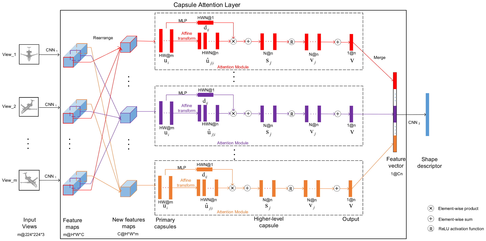 ***CACNN: Capsule Attention Convolutional Neural Networks for 3D Object Recognition***
* Kai Sun, Jiangshe Zhang, Shuang Xu, **Zixiang Zhao**, Chunxia Zhang, Junmin Liu, Junying Hu
* **IEEE Transactions on Neural Networks and Learning Systems (IEEE TNNLS) 2023**
* Propose a novel layer called capsule attention layer by using attention mechanism to fuse the features expressed by capsules    
  [Paper](https://ieeexplore.ieee.org/document/10310277), [arXiv](), [Code]()

1. 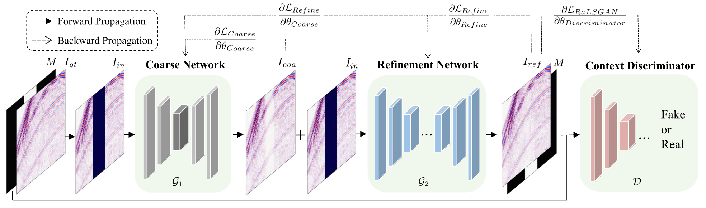 ***Hybrid Loss Guided Coarse-to-fine Model for Seismic Data Consecutively Missing Trace Reconstruction***
* Xiaoli Wei, Chunxia Zhang, Hongtao Wang, **Zixiang Zhao**, Deng Xiong, Shuang Xu, Jiangshe Zhang, Sang-Woon Kim
* **IEEE Transactions on Geoscience and Remote Sensing (IEEE TGRS) 2022** 
* Propose a coarse-to-fine seismic data consecutively missing traces interpolation    
  [Paper](https://ieeexplore.ieee.org/document/9955578), [arXiv](), [Code]()

1. 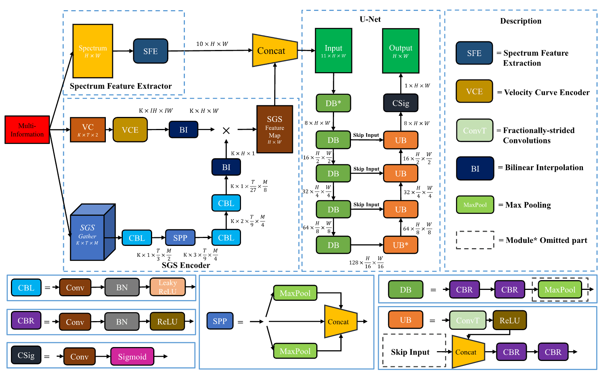 ***Automatic Velocity Picking Using a Multi-Information Fusion Deep Semantic Segmentation Network***
* Hongtao Wang, Jiangshe Zhang, **Zixiang Zhao**, Chunxia Zhang, Li Long, Zhiyu Yang, Weifeng Geng
* **IEEE Transactions on Geoscience and Remote Sensing (IEEE TGRS) 2022** 
* Propose a multi-information fusion network to estimate stacking velocity from the fusion information of velocity spectra    
  [Paper](https://ieeexplore.ieee.org/document/9815261/), [arXiv](https://arxiv.org/abs/2205.03645), [Code](https://github.com/newbee-ML/MIFN-Velocity-Picking)

1. 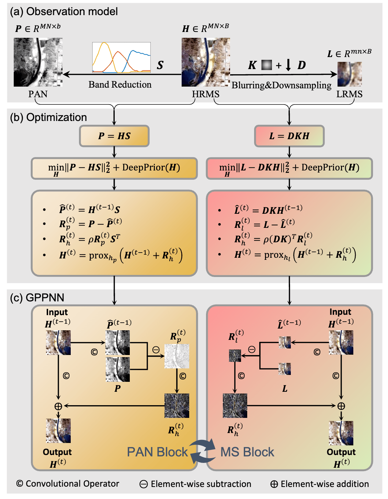 ***Deep Gradient Projection Networks for Pan-sharpening***
* Shuang Xu, Jiangshe Zhang, **Zixiang Zhao**, Kai Sun, Junmin Liu, Chunxia Zhang
* **IEEE/CVF Conference on Computer Vision and Pattern Recognition (CVPR) 2021**
* Develop a model-based deep pan-sharpening approach via Deep Gradient Projection Network     
  [Paper](https://openaccess.thecvf.com/content/CVPR2021/html/Xu_Deep_Gradient_Projection_Networks_for_Pan-sharpening_CVPR_2021_paper.html), [arXiv](https://arxiv.org/abs/2103.04584), [Code](https://github.com/xsxjtu/GPPNN)

<!-- ## <u> Preprint </u>

1. ***Domain Adaptive Object Detection via Feature Separation and Alignment***
* Chengyang Liang\*, **Zixiang Zhao**\*, Junmin Liu, Jiangshe Zhang
* Establish a Feature Separation and Alignment Network (FSANet) for domain adaptive object detection    
[arXiv](https://arxiv.org/abs/2012.08689), [Code]()

1. ***When Image Decomposition Meets Deep Learning: A Novel Infrared and Visible Image Fusion Method***
* **Zixiang Zhao**, Jiangshe Zhang, Shuang Xu, Kai Sun, Chunxia Zhang, Junmin Liu
* Journal version of IJCAI2020 paper    
  [arXiv](https://arxiv.org/abs/2009.01315), [Code]() -->

---

# Professional Services

## <u> Area Chair </u>
* IEEE/CVF Conference on Computer Vision and Pattern Recognition (CVPR)
* European Conference on Computer Vision (ECCV)
* Conference on Neural Information Processing Systems (NeurIPS)
* British Machine Vision Conference (BMVC)

## <u> PC Member | Reviewer </u>

### Conferences 

* IEEE/CVF Conference on Computer Vision and Pattern Recognition (CVPR)
* IEEE International Conference on Computer Vision (ICCV)
* European Conference on Computer Vision (ECCV)
* Conference on Neural Information Processing Systems (NeurIPS)
* International Conference on Machine Learning (ICML)
* International Conference on Learning Representations (ICLR)
* ACM SIGGRAPH
* International Joint Conference on Artificial Intelligence (IJCAI)
* AAAI Conference on Artificial Intelligence (AAAI)
* ACM Multimedia (ACMMM)
* IEEE International Conference on Robotics and Automation (ICRA)
* Asian Conference on Computer Vision (ACCV)
* ACM International Conference on Multimedia Retrieval (ICMR)

### Journals 
* IEEE Transactions on Pattern Analysis and Machine Intelligence (TPAMI)
* International Journal of Computer Vision (IJCV)
* IEEE Transactions on Image Processing (TIP)
* IEEE Transactions on Neural Networks and Learning Systems (TNNLS)
* IEEE Transactions on Multimedia (TMM)
* IEEE Transactions on Circuits and Systems for Video Technology (TCSVT)
* IEEE Transactions on Computational Imaging (TCI)
* IEEE Transactions on Knowledge and Data Engineering (TKDE)
* Information Fusion
* Pattern Recognition
* Signal Processing
* IEEE Signal Processing Letters (SPL)

## <u> Guest Editor </u>
* Remote Sensing, Special Issue, "Visual Fusion, Understanding, and Generation in Remote Sensing"
* Journal of Imaging, Special Issue, "Towards Deeper Understanding of Image and Video Processing and Analysis"
* AIMS Mathematics, Special Issue, "Deep Learning, Remote Sensing Image Processing: Methods and Applications"

## <u> Membership </u>
* IEEE Graduate Student Member
* VALSE (Vision and Learning SEminar) Student Club Member
* AI TIME PhD Branch Leader

## <u> Teaching </u>
* Teaching assistant, Image Processing, ETH Zurich, 2025 & 2026 Spring.
* Teaching assistant, Probability Theory and Mathematical Statistics, Xi'an Jiaotong University, 2019 & 2020 Spring.
* Teaching assistant, Advanced Mathematics, Xi'an Jiaotong University, 2018 & 2019 Fall.

---

# Selected Talks
* CVPR Shenzhen Pre-Conference Meeting.    
at: [04/2024] Peking University, Shenzhen, China

* Prior Knowledge-Guided Multi-Modal Image Fusion.    
at: [02/2024] University of Electronic Science and Technology of China (UESTC), Online 

* Conference on Frontiers in Mathematics Doctoral Student: Prior Knowledge-Guided Multi-Modal Image Fusion.    
at: [10/2023] Peking University, Beijing, China

* Multi-modal Image Fusion and Image Reconstruction [[Website]](https://twitter.com/CamImaging/status/1707755502203990431).        
at: [09/2023] Cambridge University, Online

* VALSE (Vision and Learning SEminar) 2022: Low-level Vision Session Student Spotlight Talk [[Website]](http://valser.org/2022/#/workshopde?id=6).    
at: [08/2022] Tianjin, China

* AI TIME PhD Presentation (CVPR 2022): Discrete Cosine Transform Network for Guided Depth Map Super-Resolution [[video (Chinese)]](https://www.bilibili.com/video/BV1cU4y1i7Nt).    
at: [08/2022] AI TIME & AMiner, Online

* 2021 IJCAI-SAIA Young Elite Symposium: Deep Image Decomposition for Infrared and Visible Image Fusion [[Website]](http://www.ijcai-saia-yes.org.cn/#/conferee).    
at: [07/2021] World Artificial Intelligence Conference & Shanghai Jiao Tong University, Shanghai, China

* AI TIME PhD Debate: Opportunities and Challenges in multimodal learning [[video (Chinese)]](https://www.bilibili.com/video/BV15h411h7M6).    
at: [07/2021] AI TIME & AMiner, Beijing, China

* AI TIME PhD Presentation (IJCAI 2020): Deep Image Decomposition for Infrared and Visible Image Fusion [[video (Chinese)]](https://www.bilibili.com/video/BV14p4y1s77p).    
at: [01/2021] AI TIME & AMiner, Beijing, China

---

# More about me!

- a die-hard fan of Kobe Bryant and Los Angeles Lakers
- have a passionate love for basketball
<!--- have a passion for basketball and participate in CUBA (Chinese University Basketball Association) -->
- love swimming, skiing, singing...
- a little guitar and violin
