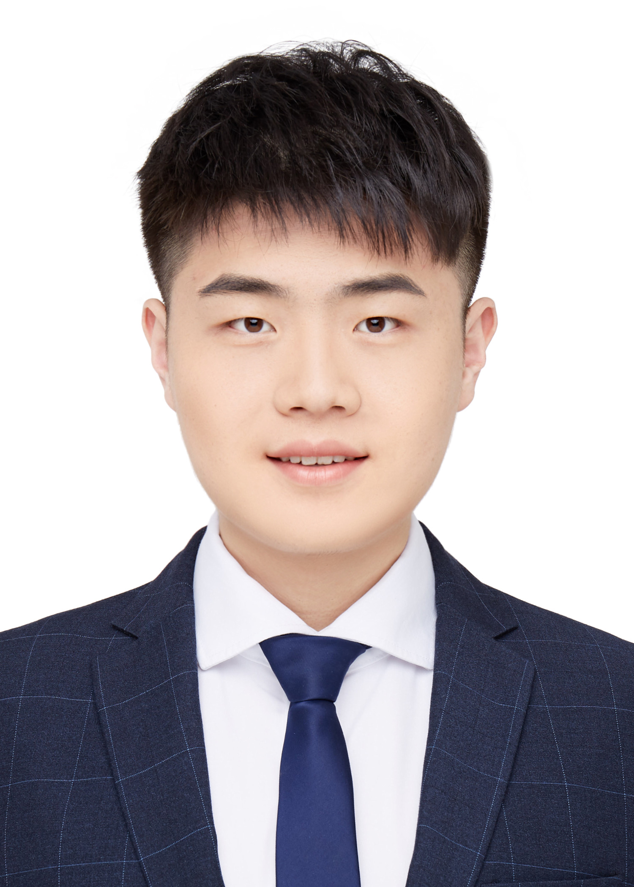

My name is **Zixiang Zhao** (赵子祥, pronounced 'Tzu-Hsiang Chao'). I am currently a Postdoctoral Researcher at [Photogrammetry and Remote Sensing Group](https://prs.igp.ethz.ch/), [ETH Zürich](https://ethz.ch/en.html), Switzerland, supervised by [Prof. Konrad Schindler](https://scholar.google.com/citations?user=FZuNgqIAAAAJ&hl=en). 

I received my Ph.D. degree in Statistics from [School of Mathematics and Statistics](http://math.xjtu.edu.cn/), [Xi'an Jiaotong University](http://www.xjtu.edu.cn/), supervised by [Prof. Jiangshe Zhang](http://gr.xjtu.edu.cn/web/jszhang) and worked closely with [Prof. Deyu Meng](https://gr.xjtu.edu.cn/en/web/dymeng) and [Prof. Shuang Xu](https://shuangxu96.github.io/).

Previously, I was a visiting Ph.D. student at [Computer Vision Lab](https://vision.ee.ethz.ch/), [ETH Zürich](https://ethz.ch/en.html), Switzerland, supervised by [Prof. Luc Van Gool](https://ee.ethz.ch/the-department/faculty/professors/person-detail.OTAyMzM=.TGlzdC80MTEsMTA1ODA0MjU5.html) and worked closely with [Prof. Radu Timofte](https://www.informatik.uni-wuerzburg.de/computervision/home/), [Dr. Yulun Zhang](http://yulunzhang.com/) and [Dr. Kai Zhang](https://cszn.github.io/). 

Additionally, I worked as a research assistant at [Visual Computing Group](https://vcg.seas.harvard.edu/), [Harvard University](https://www.harvard.edu/), USA, supervised by [Prof. Hanspeter Pfister](https://vcg.seas.harvard.edu/people) and collaborated closely with [Dr. Zudi Lin](https://zudi-lin.github.io/). I also contributed to [Multimedia Analytics Laboratory](https://kedema.org/Members.html), [City University of Hong Kong](https://www.cityu.edu.hk/), Hong Kong, supervised by [Prof. Kede Ma](https://kedema.org/).

My research lies at **low-level computer vision** and **model-based image processing**, and my current research is **multi-modal image fusion and restoration**.

I'm open to any kinds of collaboration. Please feel free to contact me directly through email.

**Email:**  
*zixiang.zhao[AT]hotmail[DOT]com*  
*zixiang.zhao[AT]ethz[DOT]ch*  
*<del>zixiangzhao[AT]stu[DOT]xjtu[DOT]edu[DOT]cn</del> (Soon to be deprecated)*

---

# CURRENT RESEARCH

1. Low-Level Vision
   - Image & Video Restoration and Enhancement
   - Image Fusion (infrared-visible, remote sensing, multi-focus, multi-exposure images)
   - Multi-modal Image Restoration
2. Computer Vision
   - Generative Models (e.g., denoising diffusion models, generative adversarial networks)
   - Domain Adaption
3. Machine Learning
   - Self-supervised learning
   - Clustering

---

# NEWS
- [2025-06] One paper on 3D indoor scene layout generation is accepted by **IROS 2025**.
- [2025-05] One paper on quantization of video generation model is accepted by **ICML 2025**.
- [2025-03] One paper on unpaired point cloud completion is accepted by **IEEE TMM**.
- [2025-02] One paper on multi-modality image fusion is accepted by **CVPR 2025  (Highlight) **.
- [2025-01] One paper on weight binarization for diffusion model is accepted by **ICLR 2025**.
- [2024-11] One paper on multi-modality image fusion is accepted by **IEEE TCSVT**.
- [2024-09] One paper on image fusion is accepted by **IJCV**; One paper on continual learning is accepted by **NeurIPS 2024**; One paper on hyper-spectral image denoising is accepted by **IEEE TGRS**.
- [2024-06] One paper on seismic data processing is accepted by **IEEE TGRS**.
- [2024-05] Two papers are accepted by **ICML 2024** (One first-authored paper on vision-language-based image fusion and the other on residual binarization for image super-resolution).
- [2024-04] Gave a presentation @ Peking University.
- [2024-02] One first-authored paper on multi-modality image fusion is accepted by **CVPR 2024**.
- [2023-10] One paper on 3D Object Recognition is accepted by **IEEE TNNLS**.
- [2023-09] Gave a presentation @ Cambridge University.
- [2023-07] Two first-authored papers on image fusion and depth map super-resolution are accepted by **ICCV 2023** (**1 Oral ** & 1 Poster).
- [2023-05] Named one of the **CVPR 2023 Outstanding Reviewers**.
- [2023-03] One first-authored paper on multi-modality image fusion is accepted by **CVPR 2023**.
- [2022-06] Two papers on seismic data processing are accepted by **IEEE TGRS**.
- [2022-03] One first-authored paper on guided depth map super-resolution is accepted by **CVPR 2022  (Oral) **.
- [2021-04] One first-authored paper on model-driven image fusion is accepted by **IEEE TCSVT**.
- [2021-03] Two papers (one first-authored) on remote sensing image processing are accepted by **ICME 2021** (**1 Oral ** & 1 Poster).
- [2021-03] One paper on remote sensing image processing is accepted by **CVPR 2021**.
- [2020-07] One first-authored paper on Bayesian image fusion is accepted by **Signal Processing**.
- [2020-04] One first-authored paper on data-driven image fusion is accepted by **IJCAI 2020**.

---

# PUBLICATIONS

You can find the full list on my [**Google Scholar**](https://scholar.google.com/citations?user=tUv_X8cAAAAJ&hl).

## <u> Selected Publications </u>
1. ***A Unified Solution to Video Fusion: From Multi-Frame Learning to Benchmarking.***
* **Zixiang Zhao**, Haowen Bai, Bingxin Ke, Yukun Cui, Lilun Deng, Yulun Zhang, Kai Zhang, Konrad Schindler
* Pioneering the first unified framework, benchmark, loss and evaluation protocol for video fusion across four key tasks    
  [*[Project Page🔥]*](https://vfbench.github.io/), [*[ArXiv]*](https://arxiv.org/abs/2505.19858), [*[Code]*](https://github.com/Zhaozixiang1228/VF-Bench)

1. ***Image Fusion via Vision-Language Model.***
* **Zixiang Zhao**, Lilun Deng, Haowen Bai, Yukun Cui, Zhipeng Zhang, Yulun Zhang, Haotong Qin, Dongdong Chen, Jiangshe Zhang, Peng Wang, Luc Van Gool
* Accepted by **ICML 2024** 
* Introduce a novel fusion paradigm, for the first time, utilizing explicit textual information to guide image fusion    
  [*[Project Page]*](https://zhaozixiang1228.github.io/Project/IF-FILM/), [*[Paper]*](https://openreview.net/pdf?id=eqY64Z1rsT), [*[ArXiv]*](https://arxiv.org/abs/2402.02235), [*[Code]*](https://github.com/Zhaozixiang1228/IF-FILM)

1. ***Equivariant Multi-Modality Image Fusion.***
* **Zixiang Zhao**, Haowen Bai, Jiangshe Zhang, Yulun Zhang, Kai Zhang, Shuang Xu, Dongdong Chen, Radu Timofte, Luc Van Gool
* Accepted by **CVPR 2024** 
* Propose a novel end-to-end self-supervised fusion algorithm based on the equivariant sensing and imaging prior     
  [*[Paper]*](https://openaccess.thecvf.com/content/CVPR2024/html/Zhao_Equivariant_Multi-Modality_Image_Fusion_CVPR_2024_paper.html), [*[ArXiv]*](https://arxiv.org/abs/2305.11443), [*[Code]*](https://github.com/Zhaozixiang1228/MMIF-EMMA)

1. ***DDFM: Denoising Diffusion Model for Multi-Modality Image Fusion.***
* **Zixiang Zhao**, Haowen Bai, Yuanzhi Zhu, Jiangshe Zhang, Shuang Xu, Yulun Zhang, Kai Zhang, Deyu Meng, Radu Timofte, Luc Van Gool
* Accepted by **ICCV 2023** ** (ORAL) **
* Propose a novel fusion algorithm based on the denoising diffusion sampling model     
  [*[Paper]*](https://openaccess.thecvf.com/content/ICCV2023/html/Zhao_DDFM_Denoising_Diffusion_Model_for_Multi-Modality_Image_Fusion_ICCV_2023_paper.html), [*[ArXiv]*](https://arxiv.org/abs/2303.06840), [*[Code]*](https://github.com/Zhaozixiang1228/MMIF-DDFM)

1. ***Spherical Space Feature Decomposition for Guided Depth Map Super-Resolution.***
* **Zixiang Zhao**, Jiangshe Zhang, Xiang Gu, Chengli Tan, Shuang Xu, Yulun Zhang, Radu Timofte, Luc Van Gool
* Accepted by **ICCV 2023** 
* Propose a Spherical Space feature Decomposition network (SSDNet) and spherical contrast refinement for guided depth super-resolution       
  [*[Paper]*](https://openaccess.thecvf.com/content/ICCV2023/html/Zhao_Spherical_Space_Feature_Decomposition_for_Guided_Depth_Map_Super-Resolution_ICCV_2023_paper.html), [*[ArXiv]*](https://arxiv.org/abs/2303.08942), [*[Code]*](https://github.com/Zhaozixiang1228/GDSR-SSDNet)

1. ***CDDFuse: Correlation-Driven Dual-Branch Feature Decomposition for Multi-Modality Image Fusion.***
* **Zixiang Zhao**, Haowen Bai, Jiangshe Zhang, Yulun Zhang, Shuang Xu, Zudi Lin, Radu Timofte, Luc Van Gool
* Accepted by **CVPR 2023** 
* Propose a Correlation-Driven feature Decomposition Fusion (CDDFuse) network for multi-modality image fusion    
  [*[Paper]*](https://openaccess.thecvf.com/content/CVPR2023/html/Zhao_CDDFuse_Correlation-Driven_Dual-Branch_Feature_Decomposition_for_Multi-Modality_Image_Fusion_CVPR_2023_paper.html), [*[ArXiv]*](https://arxiv.org/abs/2211.14461), [*[Code]*](https://github.com/Zhaozixiang1228/MMIF-CDDFuse)

1. ***Discrete Cosine Transform Network for Guided Depth Map Super-Resolution.***
* **Zixiang Zhao**, Jiangshe Zhang, Shuang Xu, Zudi Lin, Hanspeter Pfister
* Accepted by **CVPR 2022** ** (ORAL) **
* Propose an advanced Discrete Cosine Transform Network (DCTNet) for guided depth super-resolution    
  [*[Paper]*](https://openaccess.thecvf.com/content/CVPR2022/html/Zhao_Discrete_Cosine_Transform_Network_for_Guided_Depth_Map_Super-Resolution_CVPR_2022_paper.html), [*[ArXiv]*](https://arxiv.org/abs/2104.06977), [*[Code]*](https://github.com/Zhaozixiang1228/GDSR-DCTNet)

1. ***Deep Convolutional Sparse Coding Networks for Interpretable Image Fusion.***
* **Zixiang Zhao**, Jiangshe Zhang, Haowen Bai, Yicheng Wang, Yukun Cui, Lilun Deng, Kai Sun, Chunxia Zhang, Junmin Liu, Shuang Xu
* Accepted by **CVPR Workshop 2023**
* Gave three deep convolutional sparse coding networks for interpretable image fusion via unfolding the iterative shrinkage and thresholding algorithm        
  [*[Paper]*](https://openaccess.thecvf.com/content/CVPR2023W/AML/html/Zhao_Deep_Convolutional_Sparse_Coding_Networks_for_Interpretable_Image_Fusion_CVPRW_2023_paper.html), [*[Code]*](https://github.com/Zhaozixiang1228/IF-CSCFuse)

1. ***Efficient and Model-Based Infrared and Visible Image Fusion via Algorithm Unrolling.***
* **Zixiang Zhao**, Shuang Xu, Jiangshe Zhang, Junmin Liu, Chunxia Zhang, Junmin Liu
* Accepted by **IEEE Transactions on Circuits and Systems for Video Technology (IEEE TCSVT) 2021** (Top 1% Highly Cited Paper)
* Presented an algorithm unrolling based interpretable deep image decomposition network for infrared and visible image fusion    
  [*[Paper]*](https://ieeexplore.ieee.org/document/9416456), [*[Arxiv]*](https://arxiv.org/abs/2005.05896), [*[Code]*](https://github.com/Zhaozixiang1228/IVIF-AUIF-Net)

1. ***LLplace: The 3D Indoor Scene Layout Generation and Editing via Large Language Model.***
* Yixuan Yang, Junru Lu, **Zixiang Zhao**, Zhen Luo, James J.Q. Yu, Victor Sanchez, Feng Zheng
* Accepted by **Intelligent Robots and Systems (IROS) 2025**
* Presented a novel 3D indoor scene layout designer based on lightweight fine-tuned open-source LLM     
  [*[Paper]*](), [*[Arxiv]*](https://arxiv.org/abs/2406.03866), [*[Code]*]()

1. ***Q-VDiT: Towards Accurate Quantization and Distillation of Video-Generation Diffusion Transformers.***
* Weilun Feng, Chuanguang Yang, Haotong Qin, Xiangqi Li, Yu Wang, Zhulin An, Libo Huang, Boyu Diao, **Zixiang Zhao**, Yongjun Xu, Michele Magno 
* Accepted by **International Conference on Machine Learning (ICML) 2025**
* Presented Q-VDiT, a quantization framework specifically designed for video DiT models     
  [*[Paper]*](), [*[Arxiv]*](https://arxiv.org/abs/2505.22167), [*[Code]*](https://github.com/cantbebetter2/Q-VDiT)

1. ***Task-driven Image Fusion with Learnable Fusion Loss.***
* Haowen Bai, Jiangshe Zhang✉, **Zixiang Zhao✉**, Yichen Wu, Lilun Deng, Yukun Cui, Shuang Xu
* Accepted by **CVPR 2025** ** (Highlight) **
* Propose a fusion framework incorporating a learnable fusion loss guided by downstream task loss    
  [*[Paper]*](https://openaccess.thecvf.com/content/CVPR2025/html/Bai_Task-driven_Image_Fusion_with_Learnable_Fusion_Loss_CVPR_2025_paper.html), [*[Arxiv]*](https://arxiv.org/abs/2412.03240), [*[Code]*](https://github.com/HaowenBai/TDFusion)

1. ***BinaryDM: Accurate Weight Binarization for Efficient Diffusion Models.***
* Xingyu Zheng, Xianglong Liu, Haotong Qin, Xudong Ma, Mingyuan Zhang, Haojie Hao, Jiakai Wang, **Zixiang Zhao**, Jinyang Guo, Michele Magno
* Accepted by **International Conference on Learning Representations (ICLR) 2025**
* Propose a weight binarization approach for diffusion models.    
  [*[Paper]*](https://openreview.net/forum?id=YaeZwhXJ4k&nesting=2&sort=date-desc), [*[Arxiv]*](https://arxiv.org/abs/2404.05662), [*[Code]*](https://github.com/Xingyu-Zheng/BinaryDM)

1. ***RefComp: A Reference-guided Unified Framework for Unpaired Point Cloud Completion.***
* Yixuan Yang, Jinyu Yang, **Zixiang Zhao**, Victor Sanchez, Feng Zheng
* Accepted by **IEEE Transactions on Multimedia (IEEE TMM) 2025**
* Propose a unified framework for unpaired point cloud completion    
  [*[Paper]*](), [*[Arxiv]*](), [*[Code]*]()

1. ***Make Continual Learning Stronger via C-Flat.***
* Ang Bian, Wei Li, Hangjie Yuan, Yu Chengrong, Mang Wang, **Zixiang Zhao**, Aojun Lu, Pengliang Ji, Tao Feng
* Accepted by **Neural Information Processing Systems (NeurIPS) 2024**
* Propose a Continual Flatness method featuring a flatter loss landscape tailored for continual learning.    
  [*[Paper]*](https://neurips.cc/virtual/2024/poster/96074), [*[Arxiv]*](https://arxiv.org/abs/2404.00986), [*[Code]*](https://github.com/WanNaa/C-Flat)

1. ***Flexible Residual Binarization for Image Super-Resolution.***
* Yulun Zhang, Haotong Qin, **Zixiang Zhao**, Xianglong Liu, Martin Danelljan, Fisher Yu
* Accepted by **International Conference on Machine Learning (ICML) 2024**
* Proposed a flexible residual binarization image super-resolution method with second-order residual binarization and distillation-guided training.    
  [*[Paper]*](https://proceedings.mlr.press/v235/zhang24bb.html), [*[Arxiv]*](https://openreview.net/pdf?id=zji9DLksTz), [*[Code]*]()

1. ***ReFusion: Learning Image Fusion from Reconstruction with Learnable Loss via Meta-Learning.***
* Haowen Bai, **Zixiang Zhao✉**, Jiangshe Zhang✉, Yichen Wu, Lilun Deng, Yukun Cui, Shuang Xu, Baisong Jiang
* Accepted by **International Journal of Computer Vision (IJCV) 2024**
* Propose a unified meta-learning based image fusion framework that dynamically optimizes the fusion loss through source image reconstruction    
  [*[Paper]*](https://link.springer.com/article/10.1007/s11263-024-02256-8), [*[Arxiv]*](https://arxiv.org/abs/2312.07943), [*[Code]*](https://github.com/HaowenBai/ReFusion)

1. ***Deep Unfolding Multi-modal Image Fusion Network via Attribution Analysis.***
* Haowen Bai, **Zixiang Zhao**, Jiangshe Zhang, Baisong Jiang, Lilun Deng, Yukun Cui, Shuang Xu, Chunxia Zhang
* Accepted by **IEEE Transactions on Circuits and Systems for Video Technology (IEEE TCSVT) 2024**
* Employed attribution analysis to tailor fused images more effectively for semantic segmentation and enhance the fusion-segmentation interaction    
  [*[Paper]*](https://ieeexplore.ieee.org/abstract/document/10769519), [*[Arxiv]*](https://ieeexplore.ieee.org/abstract/document/10769519), [*[Code]*](https://github.com/HaowenBai/UAAFusion)

1. ***Pan-Denoising: Guided Hyperspectral Image Denoising via Weighted Represent Coefficient Total Variation.***
* Shuang Xu, Qiao Ke, Jiangjun Peng, Xiangyong Cao, **Zixiang Zhao**
* Accepted by **IEEE Transactions on Geoscience and Remote Sensing (IEEE TGRS) 2024**
* hyperspectral image denoising using panchromatic image guidance    
  [*[Paper]*](https://ieeexplore.ieee.org/document/10663706), [*[Arxiv]*](https://arxiv.org/abs/2407.06064), [*[Code]*](https://github.com/shuangxu96/PWRCTV)

1. ***Simultaneous Automatic Picking and Manual Picking Refinement for First-Break.***
* Haowen Bai, **Zixiang Zhao**, Jiangshe Zhang, Yukun Cui, Chunxia Zhang, Zhenbo Guo, Yongjun Wang
* Accepted by **IEEE Transactions on Geoscience and Remote Sensing (IEEE TGRS) 2024**
* Presented an algorithm unrolling based interpretable deep image decomposition network for infrared and visible image fusion    
  [*[Paper]*](https://ieeexplore.ieee.org/document/10310277), [*[Arxiv]*](), [*[Code]*]()

1. ***CACNN: Capsule Attention Convolutional Neural Networks for 3D Object Recognition.***
* Kai Sun, Jiangshe Zhang, Shuang Xu, **Zixiang Zhao**, Chunxia Zhang, Junmin Liu, Junying Hu
* Accepted by **IEEE Transactions on Neural Networks and Learning Systems (IEEE TNNLS) 2023**
* Presented an algorithm unrolling based interpretable deep image decomposition network for infrared and visible image fusion    
  [*[Paper]*](https://ieeexplore.ieee.org/document/10310277), [*[Arxiv]*](), [*[Code]*]()

1. ***Hybrid Loss Guided Coarse-to-fine Model for Seismic Data Consecutively Missing Trace Reconstruction.***
* Xiaoli Wei, Chunxia Zhang, Hongtao Wang, **Zixiang Zhao**, Deng Xiong, Shuang Xu, Jiangshe Zhang, Sang-Woon Kim
* Accepted by **IEEE Transactions on Geoscience and Remote Sensing  (IEEE TGRS) 2022** 
* Propose a coarse-to-fine seismic data consecutively missing traces interpolation    
  [*[Paper]*](https://ieeexplore.ieee.org/document/9955578), [*[Arxiv]*](), [*[Code]*]()

1. ***Automatic Velocity Picking Using a Multi-Information Fusion Deep Semantic Segmentation Network.***
* Hongtao Wang, Jiangshe Zhang, **Zixiang Zhao**, Chunxia Zhang, Long li, Zhiyu Yang, Weifeng Geng
* Accepted by **IEEE Transactions on Geoscience and Remote Sensing (IEEE TGRS) 2022** 
* Propose a multi-information fusion network to estimate stacking velocity from the fusion information of velocity spectra    
  [*[Paper]*](https://ieeexplore.ieee.org/document/9815261/), [*[Arxiv]*](https://arxiv.org/abs/2205.03645), [*[Code]*](https://github.com/newbee-ML/MIFN-Velocity-Picking)

1. ***Deep Gradient Projection Networks for Pan-sharpening.***
* Shuang Xu, Jiangshe Zhang, **Zixiang Zhao**, Kai Sun, Junmin Liu, Chunxia Zhang
* Accepted by **CVPR 2021**
* Develop a model-based deep pan-sharpening approach via Deep Gradient Projection Network     
  *[[Paper]](https://openaccess.thecvf.com/content/CVPR2021/html/Xu_Deep_Gradient_Projection_Networks_for_Pan-sharpening_CVPR_2021_paper.html)*, [*[ArXiv]*](https://arxiv.org/abs/2103.04584), [*[Code]*](https://github.com/xsxjtu/GPPNN)

1. ***FGF-GAN: A Lightweight Generative Adversarial Network for Pansharpening via Fast Guided Filter.***
* **Zixiang Zhao**, Jiangshe Zhang, Shuang Xu, Kai Sun, Lu Huang, Junmin Liu, Chunxia Zhang
* Accepted by **ICME 2021** ** (ORAL) **
* Propose a generative adversarial network for pansharpening via the fast guided filter and the spatial attention module    
  [*[Paper]*](https://ieeexplore.ieee.org/abstract/document/9428272), [*[ArXiv]*](https://arxiv.org/abs/2101.00062), [*[Code]*](https://github.com/Zhaozixiang1228/Pansharpening-FGF-GAN)

1. ***DIDFuse: Deep Image Decomposition for Infrared and Visible Image Fusion.***
* **Zixiang Zhao**\*, Shuang Xu\*, Chunxia Zhang, Junmin Liu, Jiangshe Zhang
* Accepted by **IJCAI 2020** 
* Proposed a data-driven auto-encoder based network to accomplish the two-scale decomposition for image fusion    
  [*[Paper]*](https://www.ijcai.org/Proceedings/2020/135), [*[ArXiv]*](https://arxiv.org/abs/2003.09210v1), [*[Code]*](https://github.com/Zhaozixiang1228/IVIF-DIDFuse), [*[Accepted list]*](http://static.ijcai.org/2020-accepted_papers.html)

1. ***Bayesian Fusion for Infrared and Visible Images.***
* **Zixiang Zhao**, Shuang Xu, Chunxia Zhang, Junmin Liu, Jiangshe Zhang
* Accepted by **Signal Processing 2020**
* Established a Bayesian fusion model with a hierarchical Bayesian manner and the total-variation penalty, which can be inferred by the EM algorithm    
  [*[Paper]*](https://www.sciencedirect.com/science/article/pii/S0165168420302772), [*[ArXiv]*](https://arxiv.org/abs/2005.05839), [*[Code]*](https://github.com/Zhaozixiang1228/IVIF-Bayesian-Fusion)

<!-- ## <u> Preprint </u>

1. ***Domain Adaptive Object Detection via Feature Separation and Alignment.***
* Chengyang Liang\*, **Zixiang Zhao**\*, Junmin Liu, Jiangshe Zhang
* Establish a Feature Separation and Alignment Network (FSANet) for domain adaptive object detection    
[*[ArXiv]*](https://arxiv.org/abs/2012.08689), [*[Code]*]()

1. ***When Image Decomposition Meets Deep Learning: A Novel Infrared and Visible Image Fusion Method.***
* **Zixiang Zhao**, Jiangshe Zhang, Shuang Xu, Kai Sun, Chunxia Zhang, Junmin Liu
* Journal version of IJCAI2020 paper    
  [*[ArXiv]*](https://arxiv.org/abs/2009.01315), [*[Code]*]() -->

---

# Professional Services

## <u> PC Member | Reviewer </u>

### Conferences 

* IEEE/CVF Conference on Computer Vision and Pattern Recognition (CVPR)
* IEEE International Conference on Computer Vision (ICCV)
* European Conference on Computer Vision (ECCV)
* Conference on Neural Information Processing Systems (NeurIPS)
* International Conference on Learning Representations (ICLR)
* ACM SIGGRAPH
* International Joint Conference on Artificial Intelligence (IJCAI)
* AAAI Conference on Artificial Intelligence (AAAI)
* ACM Multimedia (ACMMM)
* IEEE International Conference on Robotics and Automation (ICRA)
* Asian Conference on Computer Vision (ACCV)

### Journals 
* IEEE Transactions on Pattern Analysis and Machine Intelligence (TPAMI)
* International Journal of Computer Vision (IJCV)
* IEEE Transactions on Image Processing (TIP)
* IEEE Transactions on Neural Networks and Learning Systems (TNNLS)
* IEEE Transactions on Multimedia (TMM)
* IEEE Transactions on Circuits and Systems for Video Technology (TCSVT)
* IEEE Transactions on Computational Imaging (TCI)
* IEEE Transactions on Knowledge and Data Engineering (TKDE)
* Information Fusion
* Pattern Recognition
* Signal Processing
* IEEE Signal Processing Letters (SPL)

## <u> Membership </u>
* IEEE Graduate Student Member
* VALSE (Vision and Learning SEminar) Student Club Member
* AI TIME PhD Branch Leader

## <u> Teaching </u>
* Teaching assistant, Image Processing, ETH Zurich, 2025 Spring.
* Teaching assistant, Probability Theory and Mathematical Statistics, Xi'an Jiaotong University, 2019 & 2020 Spring.
* Teaching assistant, Advanced Mathematics, Xi'an Jiaotong University, 2018 & 2019 Fall.

---

# Selected Talks
* CVPR Shenzhen Pre-Conference Meeting.    
at: [04/2024] Peking University, Shenzhen, China

* Prior Knowledge-Guided Multi-Modal Image Fusion.    
at: [02/2024] University of Electronic Science and Technology of China (UESTC), Online 

* Conference on Frontiers in Mathematics Doctoral Student: Prior Knowledge-Guided Multi-Modal Image Fusion.    
at: [10/2023] Peking University, Beijing, China

* Multi-modal Image Fusion and Image Reconstruction [[Website]](https://twitter.com/CamImaging/status/1707755502203990431).        
at: [09/2023] Cambridge University, Online

* VALSE (Vision and Learning SEminar) 2022: Low-level Vision Session Student Spotlight Talk [[Website]](http://valser.org/2022/#/workshopde?id=6).    
at: [08/2022] Tianjin, China

* AI TIME PhD Presentation (CVPR 2022): Discrete Cosine Transform Network for Guided Depth Map Super-Resolution [[video (Chinese)]](https://www.bilibili.com/video/BV1cU4y1i7Nt).    
at: [08/2022] AI TIME & AMiner, Online

* 2021 IJCAI-SAIA Young Elite Symposium: Deep Image Decomposition for Infrared and Visible Image Fusion [[Website]](http://www.ijcai-saia-yes.org.cn/#/conferee).    
at: [07/2021] World Artificial Intelligence Conference & Shanghai Jiao Tong University, Shanghai, China

* AI TIME PhD Debate: Opportunities and Challenges in multimodal learning [[video (Chinese)]](https://www.bilibili.com/video/BV15h411h7M6).    
at: [07/2021] AI TIME & AMiner, Beijing, China

* AI TIME PhD Presentation (IJCAI 2020): Deep Image Decomposition for Infrared and Visible Image Fusion [[video (Chinese)]](https://www.bilibili.com/video/BV14p4y1s77p).    
at: [01/2021] AI TIME & AMiner, Beijing, China

---

# More about me!

- a die-hard fan of Kobe Bryant and Los Angeles Lakers
- have a passionate love for basketball
<!--- have a passion for basketball and participate in CUBA (Chinese University Basketball Association) -->
- love swimming, skiing, singing...
- a little guitar and violin
